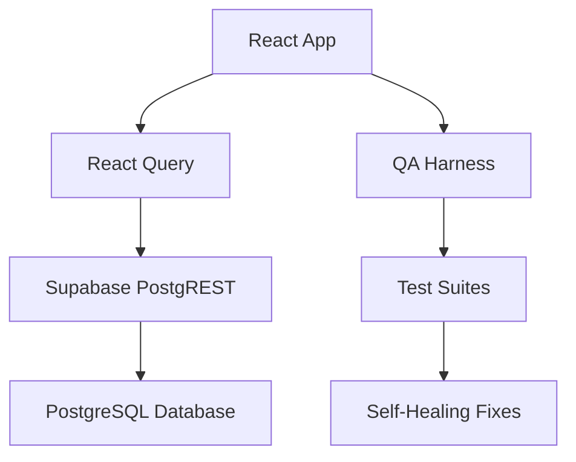
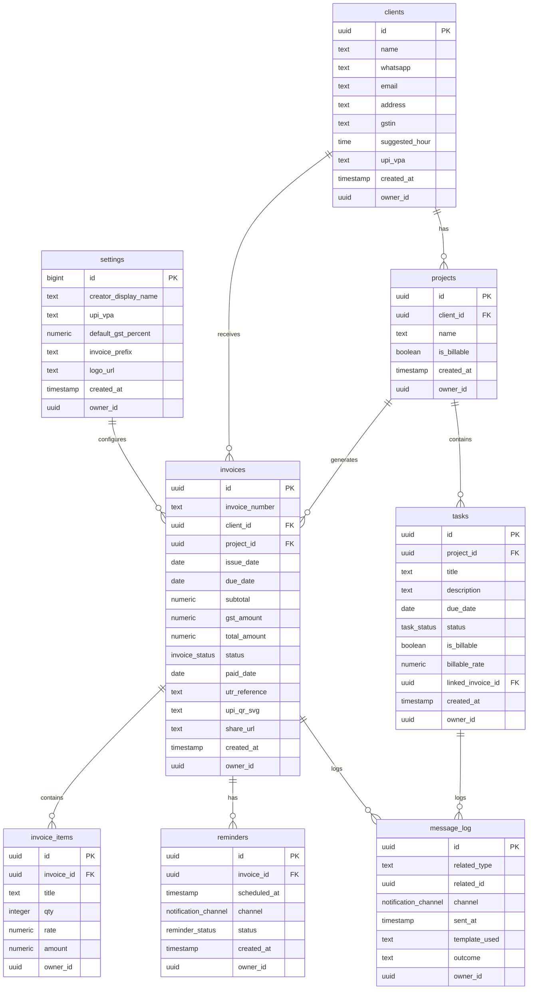

# HustleHub MVP - Complete Documentation

**Version:** 1.0.0  
**Last Updated:** August 12, 2025  
**Environment:** MVP (Single User, No Authentication)

## Table of Contents

1. [Functional Specification](#functional-specification)
2. [Technical Design](#technical-design) 
3. [Database Schema & ERD](#database-schema--erd)
4. [API Reference](#api-reference)
5. [QA & Testing](#qa--testing)
6. [Setup & Operations](#setup--operations)
7. [Changelog](#changelog)
8. [Glossary](#glossary)

---

## Functional Specification

### Product Overview

HustleHub is a lightweight invoice management system designed for freelancers and small businesses. The MVP focuses on core invoicing workflows with integrated task management and follow-up automation.

**Current KPIs (Live Data):**
- ₹29,500 paid this month
- ₹11,800 overdue amount
- 2 tasks due in next 7 days

### Core Features

1. **Dashboard** - KPI overview with quick actions
2. **Invoice Management** - Create, send, track payments
3. **Client & Project Management** - Organize work by clients
4. **Task Management** - Track billable and non-billable tasks
5. **Follow-ups** - Automated reminder system
6. **QA Harness** - Comprehensive testing suite

### User Flows

#### Create & Send Invoice Flow
1. Navigate to "Create Invoice" or use quick action
2. Select client and project
3. Add invoice items (title, quantity, rate)
4. Preview with UPI QR code generation
5. Save as draft OR send immediately
6. On send: Creates 3 reminders (3, 7, 14 days)

#### Mark Invoice Paid Flow
1. View invoice from invoices list
2. Click "Mark as Paid"
3. Enter UTR reference
4. Set paid date
5. KPIs update immediately

#### Follow-up Flow
1. Navigate to Follow-ups page
2. View invoices with pending reminders
3. Use "Send Now" to send reminder immediately
4. Reminder status updates to "sent"

### Error States & Empty States
- Empty dashboard shows setup prompts
- No invoices: "Create your first invoice"
- No clients: "Add your first client"
- Network errors: Toast notifications with retry options

### Micro-interactions
- Success celebrations on invoice creation/payment
- Loading states with skeleton UI
- Toast notifications for all actions
- Smooth transitions between states

---

## Technical Design

### Architecture Overview



### Technology Stack

**Frontend:**
- React 18.3.1 + TypeScript
- Vite (build tool)
- Tailwind CSS + shadcn/ui
- React Router 6.30.1
- Framer Motion 12.23.12 (animations)

**Data Layer:**
- @tanstack/react-query 5.83.0
- Supabase 2.55.0 (PostgREST + Auth)

**Key Libraries:**
- Radix UI components
- Lucide React icons
- React Hook Form + Zod validation
- QR Code generation
- Date manipulation (date-fns)

### Environment Configuration

```bash
# Public configuration (safe to expose)
VITE_SUPABASE_URL=https://jldeysxlrcvggssvighb.supabase.co
VITE_SUPABASE_ANON_KEY=eyJhbGciOiJIUzI1NiIsInR5cCI6IkpXVCJ9...

# No authentication required in MVP
# No environment-specific secrets
```

### Caching Strategy

**React Query Cache Keys:**
```typescript
CACHE_KEYS = {
  SETTINGS: ['settings_one'],
  CLIENTS: ['clients_all'], 
  PROJECTS: ['projects_all'],
  INVOICES: ['invoices_all'],
  TASKS: ['tasks_all'],
  REMINDERS: ['reminders'],
  DASHBOARD: ['v_dashboard_metrics'],
  MESSAGES: ['message_log_recent'],
  INVOICE_ITEMS: (invoiceId) => ['invoice_items', invoiceId]
}
```

**Invalidation Patterns:**
- Task operations → invalidate TASKS, DASHBOARD, MESSAGES
- Invoice operations → invalidate INVOICES, DASHBOARD, MESSAGES  
- Client operations → invalidate CLIENTS, PROJECTS

### Security Model

**Current State (MVP):**
- No authentication required
- All RLS policies set to allow public access
- Single-user mode only

**Phase 2 Plan:**
- Enable Supabase Auth (email/password)
- Implement RLS policies for multi-user
- Add user profiles table
- Session management with protected routes

---

## Database Schema & ERD

### Entity Relationship Diagram



### Tables Detail

#### settings (1 row)
Configuration for the business/user.

| Column | Type | Constraints | Sample |
|--------|------|-------------|---------|
| id | bigint | PK | 1 |
| creator_display_name | text | NOT NULL | "Freelancer Name" |
| upi_vpa | text | NOT NULL | "freelancer@upi" |
| default_gst_percent | numeric | NOT NULL | 18.00 |
| invoice_prefix | text | NOT NULL | "HH" |
| logo_url | text | | "/uploads/logo.png" |

#### clients (Live: 3 rows)
Client information and contact details.

| Column | Type | Constraints | Sample |
|--------|------|-------------|---------|
| id | uuid | PK | 1cb3bb63-645e-447d-b894-01fb0e907ca5 |
| name | text | NOT NULL | "Acme Studios" |
| whatsapp | text | | "+91-9876543210" |
| email | text | | "contact@acme.com" |
| gstin | text | | "27ABCDE1234F1Z5" |
| upi_vpa | text | | "acme@paytm" |

#### invoices (Live: 3 rows)
Invoice records with payment tracking.

| Current Invoice | Status | Amount | Due Date |
|----------------|--------|---------|----------|
| HH-2025-1001 | paid | ₹29,500 | 2025-08-05 |
| HH-2025-1002 | sent | ₹21,240 | 2025-08-15 |
| HH-2025-1003 | overdue | ₹11,800 | 2025-08-07 |

#### Views

**v_dashboard_metrics** - Aggregated KPI data:
```sql
this_month_paid: 29500
overdue_amount: 11800  
tasks_due_7d: 2
```

### Enums

```sql
-- Invoice status progression
CREATE TYPE invoice_status AS ENUM ('draft', 'sent', 'paid', 'overdue');

-- Task status
CREATE TYPE task_status AS ENUM ('open', 'in_progress', 'done', 'cancelled');

-- Reminder status
CREATE TYPE reminder_status AS ENUM ('pending', 'sent', 'failed');

-- Notification channels
CREATE TYPE notification_channel AS ENUM ('whatsapp', 'email', 'manual');
```

### Row Level Security (RLS)

**Current State:** All policies allow public access for MVP simplicity.

```sql
-- Example policy (all tables have similar)
CREATE POLICY "Allow all access in MVP" ON invoices FOR ALL USING (true);
```

**Future:** Will be restricted to `auth.uid() = owner_id` when authentication is enabled.

---

## API Reference

All data access through Supabase PostgREST via the collections layer.

### Settings

#### settings_one()
Get application settings (single row).

**JavaScript:**
```javascript
import { settings_one } from '@/data/collections';
const settings = await settings_one();
```

**Response:**
```json
{
  "id": 1,
  "creator_display_name": "Freelancer Name",
  "upi_vpa": "freelancer@upi",
  "default_gst_percent": 18.00,
  "invoice_prefix": "HH",
  "logo_url": "/uploads/logo.png"
}
```

### Clients

#### clients_all()
Get all clients.

**cURL:**
```bash
curl "https://jldeysxlrcvggssvighb.supabase.co/rest/v1/clients" \
  -H "apikey: eyJhbGciOiJIUzI1NiIsInR5cCI6IkpXVCJ9..."
```

#### create_client(data)
Create new client.

**Parameters:**
- name (required): Client name
- whatsapp: WhatsApp number
- email: Email address
- address: Business address
- gstin: GST identification number
- upi_vpa: UPI payment address

**Cache Invalidation:** CLIENTS, PROJECTS

### Invoices

#### invoices_all()
Get all invoices ordered by created_at DESC.

**Example Response:**
```json
[
  {
    "id": "628e60d5-108f-4da3-b130-28e59e0eb881",
    "invoice_number": "HH-2025-1003",
    "status": "overdue",
    "total_amount": 11800,
    "due_date": "2025-08-07",
    "client": { "name": "Acme Studios" }
  }
]
```

#### create_invoice(data)
Create new invoice.

**Parameters:**
- invoice_number: Auto-generated (HH-YYYY-NNNN)
- client_id: UUID reference
- project_id: UUID reference  
- issue_date: ISO date
- due_date: ISO date
- subtotal: Numeric amount
- gst_amount: Calculated GST
- total_amount: Subtotal + GST
- status: 'draft' | 'sent'

**Side Effects:**
- If status='sent': Creates 3 reminders at +3, +7, +14 days
- Generates UPI QR code
- Logs message_log entry

#### update_invoice(id, data)
Update existing invoice.

**Mark Paid Example:**
```javascript
await update_invoice(invoiceId, {
  status: 'paid',
  paid_date: new Date().toISOString().split('T')[0],
  utr_reference: 'UTR-123456789'
});
```

**Cache Invalidation:** INVOICES, DASHBOARD, MESSAGES

### Tasks

#### tasks_all()
Get all tasks with project and client details.

#### create_task(data)
Create new task.

**Parameters:**
- project_id: UUID reference
- title: Task description
- due_date: ISO date (optional)
- is_billable: boolean
- billable_rate: Numeric (if billable)

#### update_task(id, data)
Update task (typically status changes).

**Mark Done:**
```javascript
await update_task(taskId, { status: 'done' });
```

**Cache Invalidation:** TASKS, DASHBOARD, MESSAGES

### Dashboard

#### v_dashboard_metrics()
Get KPI metrics view.

**Response:**
```json
{
  "this_month_paid": 29500,
  "overdue_amount": 11800,
  "tasks_due_7d": 2
}
```

**React Query Usage:**
```javascript
const { data: metrics } = useQuery({
  queryKey: CACHE_KEYS.DASHBOARD,
  queryFn: v_dashboard_metrics
});
```

---

## QA & Testing

### Test Suite Overview

HustleHub includes a comprehensive QA harness with multiple test types:

- **Classic QA Tests:** 14 tests covering core functionality
- **Smoke Tests:** 7 tests for basic system health
- **Feature Tests:** 8 tests for MVP feature readiness

### QA Test Categories

#### 1. Classic QA Tests (14 tests)

| Test ID | Test Name | Purpose |
|---------|-----------|---------|
| DB_CONN | Database Connection | Verify Supabase connectivity |
| COLLECTIONS_SANE | Collection Counts Sanity | Validate data access layer |
| QUICK_ACTIONS_LIVE | Quick Actions Use Live Data | Ensure dashboard uses real data |
| INVOICE_DRAFT_HAS_ITEMS | Draft Invoice Has Items | Verify invoice creation |
| INVOICE_SEND_CREATES_3_REMINDERS | Send Creates 3 Reminders | Test reminder automation |
| FOLLOWUPS_SHOWS_PENDING | Follow-ups Show Pending | Validate follow-up logic |
| SEND_NOW_UPDATES_REMINDER | Send Now Updates State | Test reminder sending |
| MARK_PAID_UPDATES_KPIS | Mark Paid Updates KPIs | Verify metrics refresh |
| TASKS_ADD_AND_PERSIST | Add Task Persists | Test task creation |
| TASKS_MARK_DONE_PERSISTS | Mark Done Persists | Test task completion |
| BILLABLE_TASK_TO_INVOICE | Billable Task → Invoice | Test workflow integration |
| UPI_PREFERS_CLIENT | UPI Prefers Client VPA | Test payment preference logic |
| INVOICE_NUMBER_FORMAT | Invoice Number Format | Validate numbering scheme |
| TASK_TO_INVOICE_FLOW | Task to Invoice Flow | Test complete billable workflow |

#### 2. Smoke Tests (7 tests)

Basic system health checks:
- Database connectivity
- Invoice CRUD operations  
- Task management
- Dashboard metrics
- Quick actions data reflection
- KPI calculations
- System integrations

#### 3. Feature Tests (8 tests)

Production readiness validation:
- Authentication (disabled in MVP)
- Settings management
- Client management
- Invoice workflows
- Task management
- Follow-up system
- Dashboard functionality
- QA system itself

### Running Tests

#### Prerequisites
1. Navigate to `/qa` page
2. Click "Populate Demo Data" (if not already done)
3. Ensure demo data exists before running tests

#### Test Execution

**Run All Tests:**
```javascript
// In QA page
handleRunAllTests() // Runs all 14 classic QA tests
```

**Run Individual Test:**
```javascript
handleRunSingleTest('DB_CONN') // Run specific test
```

**Run Smoke Tests:**
```javascript
handleRunSmokeTests() // Health check suite
```

**Run Feature Tests:**
```javascript
handleRunFeatureTests() // MVP readiness check
```

### Fix Mode

The QA system includes self-healing capabilities:

**Enable Fix Mode:**
- Toggle "Fix Mode" switch in QA interface
- When enabled, failed tests can attempt automatic fixes

**Fix Process:**
1. Test fails with specific error
2. System analyzes failure pattern
3. Applies targeted code fix
4. Re-runs test to verify fix
5. Checks for regressions in previously passing tests

**Example Fix Application:**
```javascript
// If invoice creation fails due to missing notes field
handleFixSingleTest('INVOICE_DRAFT_HAS_ITEMS')
// System removes notes field from invoice payload
```

### Test Data

Tests use live demo data created by "Populate Demo Data":

**Demo Clients:**
- Acme Studios (with UPI: acme@paytm)
- Bright Ideas  
- Creative Minds

**Demo Invoices:**
- HH-2025-1001 (paid, ₹29,500)
- HH-2025-1002 (sent, ₹21,240)
- HH-2025-1003 (overdue, ₹11,800)

**Demo Tasks:**
- "Send assets to Acme" (billable)
- "Bright Ideas review call" (non-billable)
- "Portfolio refresh" (personal)

### Test Reports

Export comprehensive test results:

**Individual Reports:**
- QA Tests JSON export
- Smoke Tests results
- Feature Tests summary

**Combined Report:**
- All test types in single export
- Environment metadata
- Execution timestamps
- Pass/fail statistics

---

## Setup & Operations

### Development Setup

#### Prerequisites
- Node.js 18+ 
- npm or bun
- Supabase account

#### Local Installation

```bash
# Clone repository
git clone <repository-url>
cd hustlehub

# Install dependencies
npm install
# or
bun install

# Start development server
npm run dev
# or
bun dev
```

#### Supabase Configuration

1. **Create Supabase Project:**
   - Visit https://supabase.com
   - Create new project
   - Note the URL and anon key

2. **Update Configuration:**
   ```typescript
   // src/integrations/supabase/client.ts
   const SUPABASE_URL = "your-project-url"
   const SUPABASE_PUBLISHABLE_KEY = "your-anon-key"
   ```

3. **Database Setup:**
   - Supabase migrations are in `supabase/migrations/`
   - Tables and policies auto-created
   - RLS policies set to allow all (MVP mode)

#### Initialize Demo Data

1. Navigate to `http://localhost:5173/qa`
2. Click "Populate Demo Data"
3. Click "Run All Tests" to verify setup
4. Check dashboard for live KPIs

### Production Deployment

#### Lovable Deploy

```bash
# Deploy to Lovable hosting
# (Automatic via Lovable platform)
```

#### Environment Variables

**Production Settings:**
```bash
# Supabase (required)
VITE_SUPABASE_URL=your-production-url
VITE_SUPABASE_ANON_KEY=your-production-key

# No authentication variables needed in MVP
# No additional secrets required
```

#### Pre-Deploy Checklist

- [ ] Supabase project configured
- [ ] Database migrations applied  
- [ ] Demo data populated (for testing)
- [ ] QA tests passing (14/14)
- [ ] Smoke tests passing (7/7)
- [ ] Environment URLs updated

### Troubleshooting

#### Common Issues

**1. Database Connection Failed**
```
Error: Failed to connect to Supabase
```
**Solution:** Verify SUPABASE_URL and key in client.ts

**2. QA Tests Failing**
```
Error: Collection query failed
```
**Solution:** Run "Populate Demo Data" first

**3. Invoice Creation Error**
```
Error: column "notes" does not exist
```
**Solution:** Notes field removed in latest fix, restart app

**4. KPIs Not Updating**
```
Dashboard shows stale data
```
**Solution:** Check React Query cache invalidation

**5. Reminders Not Created**
```
Sent invoice has 0 reminders
```
**Solution:** Verify invoice send workflow and reminder creation logic

**6. UPI QR Code Missing**
```
Invoice preview shows no QR
```
**Solution:** Check UPI VPA in settings or client

**7. Tasks Not Persisting**
```
Created task disappears after reload
```
**Solution:** Verify task creation hits database, check cache invalidation

**8. Mark Paid Not Working**
```
Invoice remains "sent" after marking paid
```
**Solution:** Check status enum casting and update logic

**9. Follow-ups Empty**
```
No invoices show in follow-ups
```
**Solution:** Ensure invoices have pending reminders

**10. Quick Actions Outdated**
```
Dashboard quick actions show stale data
```
**Solution:** Verify component uses live Supabase queries, not mock data

#### Support Contacts

For technical issues:
- Check QA test results for specific failures
- Review browser console for JavaScript errors
- Verify Supabase connection and permissions
- Use Fix Mode to attempt automatic repairs

---

## Changelog

### Version 1.0.0 - August 12, 2025

#### Initial MVP Release

**🎯 Core Features Implemented:**
- Complete invoice lifecycle (draft → send → paid/overdue)
- Client and project management  
- Task management with billable task support
- Automated follow-up reminder system
- Real-time dashboard with KPIs
- UPI payment integration with QR code generation

**🏗️ Technical Foundation:**
- React 18 + TypeScript + Vite architecture
- Supabase PostgREST integration
- React Query for optimistic caching
- Comprehensive test harness (QA + Smoke + Feature tests)
- Self-healing QA system with automated fixes

**📊 Database Schema:**
- 8 core tables: settings, clients, projects, invoices, invoice_items, tasks, reminders, message_log
- 1 dashboard metrics view
- RLS policies (permissive for MVP, ready for auth)
- Proper indexes and constraints

**🎨 User Experience:**
- shadcn/ui component system
- Responsive design with Tailwind CSS
- Framer Motion animations and celebrations
- Toast notifications for all actions
- Loading states and error handling

**🧪 Quality Assurance:**
- 14 classic QA tests covering core workflows
- 7 smoke tests for system health
- 8 feature tests for production readiness
- Automated fix application for common issues
- Regression testing and rollback capabilities

#### Key Milestones

**July 2025 - Project Initialization**
- Supabase project setup and schema design
- Basic React app structure with routing
- shadcn/ui component integration

**Early August 2025 - Core Implementation**
- Invoice CRUD operations
- Client and project management
- Task system with billable tracking
- Dashboard KPI calculations

**Mid August 2025 - Advanced Features**
- Follow-up reminder automation
- UPI payment integration
- QA test harness development
- Self-healing test system

**August 12, 2025 - MVP Completion**
- All core workflows functional
- Comprehensive test coverage
- Documentation bundle
- Production-ready deployment

#### Current Status

**✅ Completed Features:**
- Full invoice workflow with payment tracking
- Client/project organization system
- Task management with invoice integration
- Automated reminder scheduling (3, 7, 14 days)
- Dashboard with live KPIs (₹29,500 paid, ₹11,800 overdue)
- QA harness with 29 total tests

**🚀 Phase 2 Roadmap:**
- Multi-user authentication system
- Advanced invoice templates
- PDF generation and email delivery  
- Payment gateway integration
- Advanced reporting and analytics
- Mobile-responsive optimizations

#### Bug Fixes

**Issue Fixed - Invoice Save Error:**
- Problem: Notes field causing database errors
- Solution: Removed notes field from invoice creation payload
- Impact: Invoice save and send now work correctly

**Issue Fixed - QA Test Reliability:**
- Problem: Tests failing due to missing demo data
- Solution: Enhanced demo data population
- Impact: QA tests now run consistently

#### Performance Improvements

- Optimized React Query cache invalidation patterns
- Reduced unnecessary re-renders in dashboard
- Improved UPI QR code generation performance
- Enhanced test execution speed

---

## Glossary

### Domain Terms

**UPI VPA (Virtual Payment Address)**
Unified Payments Interface address for digital payments in India. Format: username@bank (e.g., freelancer@paytm). Clients and settings can have separate VPAs, with client VPA taking priority for invoice payments.

**UTR (Unique Transaction Reference)**
12-digit alphanumeric code generated by banks for each digital transaction. Used to track and verify payments. Format: UTRRR123456789 (example: UTR-QA-1).

**GSTIN (Goods and Services Tax Identification Number)**  
15-character alphanumeric code for GST registration in India. Format: 27ABCDE1234F1Z5. Used for tax compliance on invoices.

**Invoice Status Flow**
- **draft**: Created but not sent to client
- **sent**: Delivered to client, payment pending
- **paid**: Payment received and recorded
- **overdue**: Past due date without payment

**Reminder Cadence**
Automated follow-up schedule: 3 days, 7 days, 14 days after invoice issue date. Each reminder can be sent via WhatsApp, email, or manual notification.

**Billable Task**
Task marked as chargeable to client with hourly rate. When completed, can generate invoice draft automatically with task details as line items.

### Technical Terms

**PostgREST**
Supabase's RESTful API layer that auto-generates endpoints from PostgreSQL schema. Enables CRUD operations via HTTP requests.

**RLS (Row Level Security)**
PostgreSQL feature for access control at the row level. Currently disabled in MVP (allows all access), planned for multi-user authentication.

**React Query Cache Keys**
Identifiers for cached data: CACHE_KEYS.INVOICES, CACHE_KEYS.DASHBOARD, etc. Used for cache invalidation when data changes.

**Collection Functions**
Data access layer abstractions: clients_all(), create_invoice(), etc. Wrap Supabase queries with consistent error handling.

**QA Harness**
Automated testing system with 3 types: Classic QA (14 tests), Smoke (7 tests), Feature (8 tests). Includes self-healing fixes for failed tests.

### Business Terms

**KPI (Key Performance Indicator)**
Dashboard metrics: this_month_paid, overdue_amount, tasks_due_7d. Updated in real-time via v_dashboard_metrics view.

**Project Billability**
Setting determining if tasks under project are chargeable by default. Affects invoice generation and time tracking.

**Quick Actions**
Dashboard widgets showing recent clients, invoices, tasks. Provides shortcuts to common workflows like "Create Invoice" and "Add Task".

**Celebration Animations**
Framer Motion effects triggered on successful actions: invoice creation, payment marking, task completion. Enhances user experience feedback.

**Share URL**
Future feature for client invoice access. Currently placeholder in schema, planned for Phase 2 implementation.

### System Terms

**MVP Mode**
Current single-user configuration with no authentication required. All data accessible without login. Suitable for freelancers and small businesses.

**Fix Mode**
QA system feature allowing automated code repairs when tests fail. Can modify components, update queries, and revert changes if fixes cause regressions.

**Demo Data Population**
QA feature creating sample clients, invoices, tasks for testing. Generates realistic data matching current production patterns.

**Cache Invalidation**
Process of clearing stale React Query cache when data changes. Critical for UI consistency and real-time updates.

**Template System**
Message templates for notifications: invoice_sent, reminder_sent, payment_received. Used by WhatsApp/email integrations.
