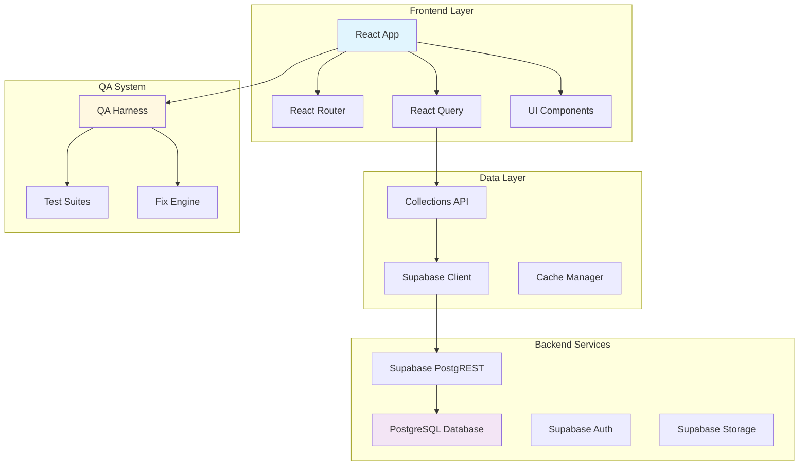
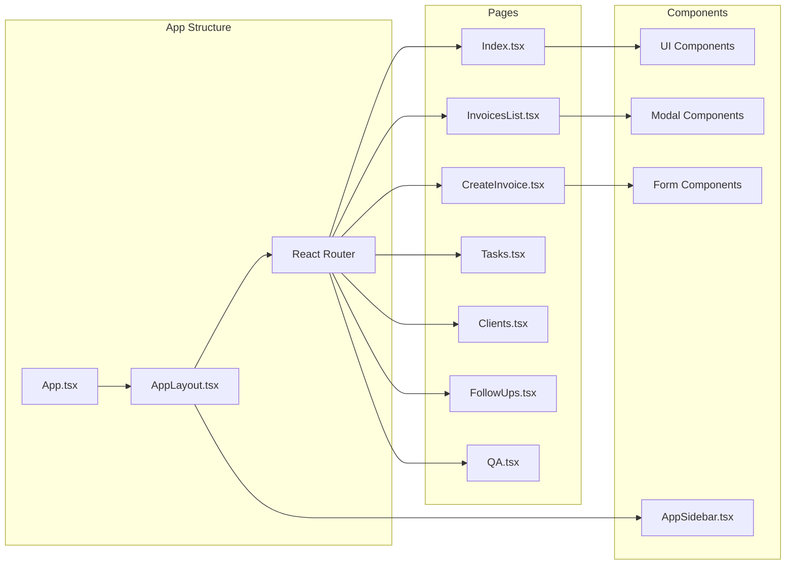
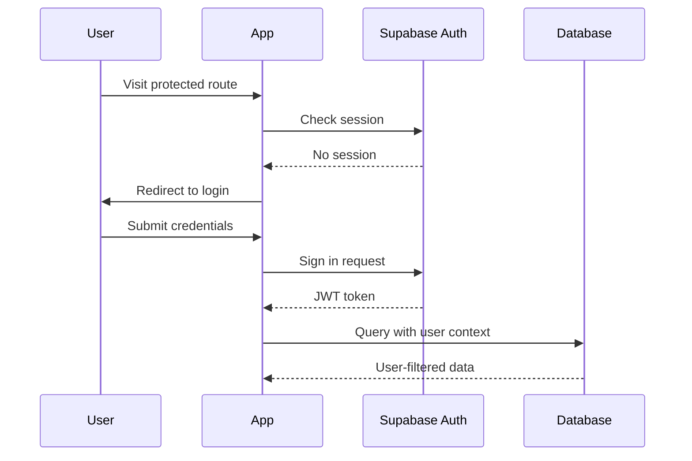
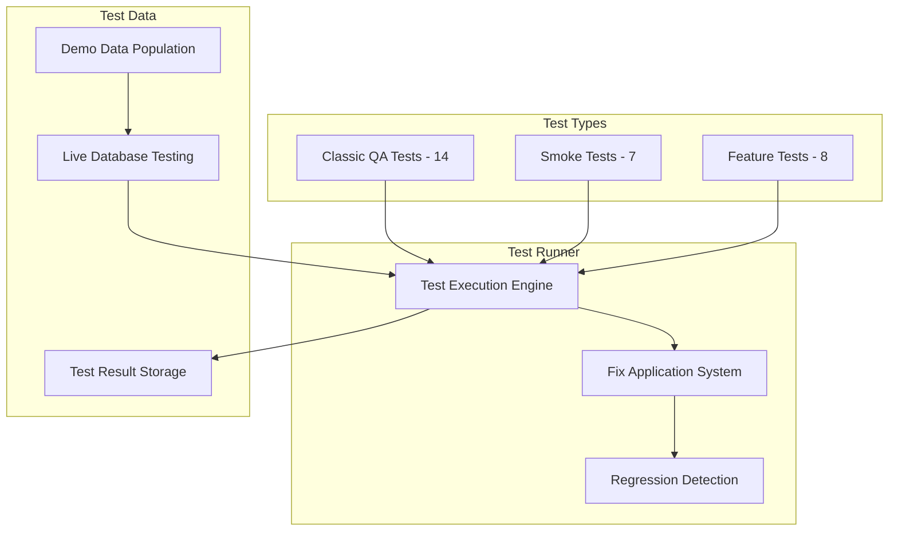

# HustleHub MVP - Technical Design

## Architecture Overview

### System Architecture



### Component Architecture



## Technology Stack

### Frontend Technologies

**Core Framework:**
- **React 18.3.1** - Component-based UI library
- **TypeScript** - Static type checking
- **Vite** - Build tool and development server

**Routing & State:**
- **React Router 6.30.1** - Client-side routing
- **Zustand 4.5.7** - Lightweight state management
- **@tanstack/react-query 5.83.0** - Server state management

**UI & Styling:**
- **Tailwind CSS** - Utility-first CSS framework
- **shadcn/ui** - Component library built on Radix UI
- **Radix UI** - Unstyled, accessible UI primitives
- **Framer Motion 12.23.12** - Animation library

**Form Handling:**
- **React Hook Form 7.61.1** - Performant forms with minimal re-renders
- **@hookform/resolvers 3.10.0** - Validation resolvers
- **Zod 3.25.76** - TypeScript-first schema validation

**Icons & Assets:**
- **Lucide React 0.462.0** - Modern icon library
- **QR Code React 3.2.0** - UPI QR code generation

### Backend & Data

**Backend as a Service:**
- **Supabase 2.55.0** - Complete backend platform
  - PostgREST API for database operations
  - Authentication (disabled in MVP)
  - Real-time subscriptions
  - File storage

**Database:**
- **PostgreSQL** - Primary database via Supabase
- **Row Level Security** - Security policies (disabled in MVP)

### Development Tools

**Build & Development:**
- **Vite** - Fast build tool with HMR
- **TypeScript** - Type safety and developer experience
- **ESLint** - Code linting and formatting

**Package Management:**
- **npm/bun** - Package manager
- **Node.js 18+** - Runtime requirement

## Project Structure

```
src/
├── components/           # Reusable UI components
│   ├── ui/              # shadcn/ui components
│   ├── auth/            # Authentication components
│   ├── celebrations/    # Animation components
│   └── layout/          # Layout components
├── pages/               # Route-based page components
│   ├── auth/            # Authentication pages
│   ├── invoices/        # Invoice management pages
│   └── *.tsx            # Main application pages
├── hooks/               # Custom React hooks
├── lib/                 # Utility libraries
├── data/                # Data access layer (collections)
├── store/               # Zustand state stores
├── types.ts             # TypeScript type definitions
├── qa/                  # QA testing system
└── integrations/        # External service integrations
    └── supabase/        # Supabase client and types
```

## Data Layer Design

### Collections API Pattern

The application uses a collections-based data access layer that abstracts Supabase operations:

```typescript
// Example: src/data/collections.ts
export const clients_all = async () => {
  const { data, error } = await supabase
    .from('clients')
    .select('*')
    .order('created_at', { ascending: false });
  
  if (error) throw error;
  return data;
};

export const create_client = async (clientData: ClientInsert) => {
  const { data, error } = await supabase
    .from('clients')
    .insert(clientData)
    .select()
    .single();
    
  if (error) throw error;
  return data;
};
```

**Benefits:**
- Consistent error handling across all data operations
- Type safety with TypeScript
- Easy to mock for testing
- Single source of truth for database queries

### React Query Integration

```typescript
// Caching strategy with React Query
export const CACHE_KEYS = {
  SETTINGS: ['settings_one'],
  CLIENTS: ['clients_all'], 
  PROJECTS: ['projects_all'],
  INVOICES: ['invoices_all'],
  TASKS: ['tasks_all'],
  REMINDERS: ['reminders'],
  DASHBOARD: ['v_dashboard_metrics'],
  MESSAGES: ['message_log_recent'],
  INVOICE_ITEMS: (invoiceId: string) => ['invoice_items', invoiceId]
} as const;

// Usage in components
const { data: clients, isLoading } = useQuery({
  queryKey: CACHE_KEYS.CLIENTS,
  queryFn: clients_all
});
```

### Cache Invalidation Strategy

```typescript
// Invalidation helpers for related data
export const invalidateTaskCaches = (queryClient: any) => {
  return Promise.all([
    queryClient.invalidateQueries({ queryKey: CACHE_KEYS.TASKS }),
    queryClient.invalidateQueries({ queryKey: CACHE_KEYS.DASHBOARD }),
    queryClient.invalidateQueries({ queryKey: CACHE_KEYS.MESSAGES })
  ]);
};

// Triggered after data mutations
const createTaskMutation = useMutation({
  mutationFn: create_task,
  onSuccess: () => {
    invalidateTaskCaches(queryClient);
    toast({ title: "Task created successfully" });
  }
});
```

## State Management

### Local State (React Hook State)
- Component-specific state (form inputs, modal visibility)
- UI state that doesn't need persistence
- Temporary interaction state

### Server State (React Query)
- All data from Supabase
- Cached with intelligent invalidation
- Optimistic updates for better UX

### Global State (Zustand)
Currently minimal, mainly for:
- App-wide settings
- User preferences
- Cross-component communication

```typescript
// Example store
interface AppStore {
  fixMode: boolean;
  setFixMode: (enabled: boolean) => void;
}

export const useAppStore = create<AppStore>((set) => ({
  fixMode: false,
  setFixMode: (enabled) => set({ fixMode: enabled })
}));
```

## Component Design Patterns

### 1. Composition Pattern

```typescript
// Flexible modal composition
<Dialog>
  <DialogTrigger asChild>
    <Button>Add Client</Button>
  </DialogTrigger>
  <DialogContent>
    <DialogHeader>
      <DialogTitle>Add New Client</DialogTitle>
    </DialogHeader>
    <AddClientForm onSuccess={() => setOpen(false)} />
  </DialogContent>
</Dialog>
```

### 2. Compound Components

```typescript
// Card component with subcomponents
<Card>
  <CardHeader>
    <CardTitle>Monthly Revenue</CardTitle>
  </CardHeader>
  <CardContent>
    <div className="text-2xl font-bold">₹29,500</div>
  </CardContent>
</Card>
```

### 3. Custom Hooks Pattern

```typescript
// Reusable data fetching logic
export function useInvoices() {
  return useQuery({
    queryKey: CACHE_KEYS.INVOICES,
    queryFn: invoices_all
  });
}

// Usage in components
const { data: invoices, isLoading, error } = useInvoices();
```

## Error Handling Strategy

### API Error Handling

```typescript
// Centralized error handling in collections
export const handleSupabaseError = (error: any) => {
  if (error.code === 'PGRST116') {
    throw new Error('Record not found');
  }
  if (error.code === '23505') {
    throw new Error('Duplicate entry');
  }
  throw new Error(error.message || 'Database operation failed');
};
```

### UI Error Boundaries

```typescript
// Component-level error boundaries
class ErrorBoundary extends React.Component {
  state = { hasError: false };
  
  static getDerivedStateFromError(error: Error) {
    return { hasError: true };
  }
  
  render() {
    if (this.state.hasError) {
      return <ErrorFallback />;
    }
    return this.props.children;
  }
}
```

### Toast Notifications

```typescript
// Consistent error feedback
const handleError = (error: Error) => {
  toast({
    title: "Operation Failed",
    description: error.message,
    variant: "destructive"
  });
};
```

## Performance Optimizations

### React Query Optimizations

```typescript
// Stale-while-revalidate pattern
const queryOptions = {
  staleTime: 5 * 60 * 1000, // 5 minutes
  cacheTime: 10 * 60 * 1000, // 10 minutes
  refetchOnWindowFocus: false,
  retry: (failureCount: number, error: any) => {
    if (error.status === 404) return false;
    return failureCount < 3;
  }
};
```

### Code Splitting

```typescript
// Lazy loading for route components
const QA = lazy(() => import('@/pages/QA'));
const CreateInvoice = lazy(() => import('@/pages/invoices/CreateInvoice'));

// Route definition with Suspense
<Route 
  path="/qa" 
  element={
    <Suspense fallback={<LoadingSpinner />}>
      <QA />
    </Suspense>
  } 
/>
```

### Memoization

```typescript
// Expensive calculations
const dashboardMetrics = useMemo(() => {
  return calculateKPIs(invoices, tasks);
}, [invoices, tasks]);

// Component memoization
const InvoiceItem = React.memo(({ invoice }: { invoice: Invoice }) => {
  return <div>{invoice.invoice_number}</div>;
});
```

## Environment Configuration

### Development Environment

```typescript
// src/integrations/supabase/client.ts
const SUPABASE_URL = "https://jldeysxlrcvggssvighb.supabase.co";
const SUPABASE_PUBLISHABLE_KEY = "eyJhbGciOiJIUzI1NiIsInR5cCI6IkpXVCJ9...";

export const supabase = createClient<Database>(SUPABASE_URL, SUPABASE_PUBLISHABLE_KEY, {
  auth: {
    storage: localStorage,
    persistSession: true,
    autoRefreshToken: true,
  }
});
```

### Environment Variables (Inferred)

```bash
# No environment variables currently required
# All configuration is hardcoded for MVP simplicity
# Future: Move to environment-based configuration

# VITE_SUPABASE_URL=your-project-url
# VITE_SUPABASE_ANON_KEY=your-anon-key
# VITE_ENVIRONMENT=development|production
```

## Security Architecture

### Current Security Model (MVP)

**Authentication:** Disabled - No login required
**Authorization:** All access allowed via RLS policies
**Data Access:** Public read/write access to all tables

```sql
-- Example RLS policy (current)
CREATE POLICY "Allow all access in MVP" 
ON invoices FOR ALL 
USING (true);
```

### Planned Security Model (Phase 2)

**Authentication Flow:**


**RLS Policies (Future):**
```sql
-- Secure access by user
CREATE POLICY "Users can only see their own invoices" 
ON invoices FOR ALL 
USING (auth.uid() = owner_id);

CREATE POLICY "Users can only modify their own data" 
ON invoices FOR UPDATE 
USING (auth.uid() = owner_id);
```

## Testing Architecture

### QA System Design



### Test Categories

**1. Classic QA Tests (14 tests)**
- Database connectivity and data consistency
- Core workflow integrity
- UI-backend integration
- Business logic validation

**2. Smoke Tests (7 tests)**  
- Basic system health checks
- Critical path verification
- API endpoint availability
- Data model integrity

**3. Feature Tests (8 tests)**
- Production readiness validation
- User experience verification
- Integration completeness
- Performance benchmarks

### Self-Healing System

```typescript
// Fix application pattern
interface QATest {
  id: string;
  name: string;
  run: () => Promise<{ pass: boolean; notes?: string }>;
  fix?: () => Promise<{ applied: boolean; notes?: string }>;
}

// Example fix
const INVOICE_CREATION_FIX = {
  id: 'INVOICE_DRAFT_HAS_ITEMS',
  fix: async () => {
    // Detect issue: notes field causing errors
    // Apply fix: remove notes from payload
    // Return success/failure status
    return { applied: true, notes: 'Removed notes field from invoice creation' };
  }
};
```

## Deployment Architecture

### Build Process

```bash
# Development
npm run dev          # Vite dev server with HMR
npm run build        # Production build
npm run preview      # Preview production build

# Type checking
npm run type-check   # TypeScript validation
```

### Production Deployment (Lovable)

**Build Output:**
- Static assets optimized and bundled
- TypeScript compiled to JavaScript
- CSS optimized and purged
- Assets fingerprinted for caching

**Environment Requirements:**
- Node.js 18+ for build process
- Static file serving for SPA
- HTTPS required for Supabase
- Modern browser support (ES2020+)

## Future Technical Roadmap

### Phase 2 Enhancements

**Authentication System:**
- Supabase Auth integration
- Protected routes with React Router
- User session management
- Password reset flows

**Advanced Features:**
- PDF generation (jsPDF or similar)
- Email integration (SendGrid/Mailgun)
- File upload system (Supabase Storage)
- Real-time notifications (Supabase Realtime)

**Performance Improvements:**
- Virtual scrolling for large datasets
- Background sync for offline support
- Service worker for caching
- Image optimization and lazy loading

**Developer Experience:**
- Comprehensive test coverage (Jest/Vitest)
- Storybook for component development
- End-to-end testing (Playwright)
- CI/CD pipeline automation

### Scalability Considerations

**Database Optimization:**
- Proper indexing strategy
- Query optimization
- Connection pooling
- Read replicas for analytics

**Frontend Optimization:**
- Micro-frontend architecture
- Advanced code splitting
- CDN integration
- Progressive Web App features

**Monitoring & Observability:**
- Error tracking (Sentry)
- Performance monitoring
- User analytics
- Health check endpoints
