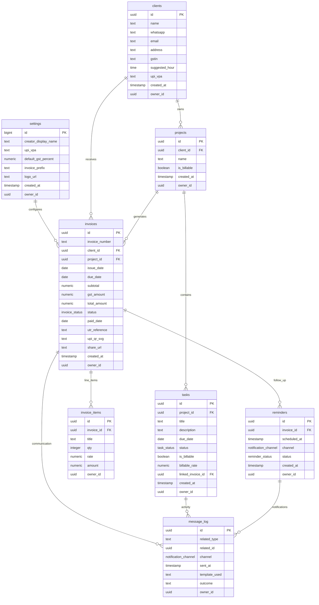

# HustleHub MVP - Database Schema & ERD

## Entity Relationship Diagram



## Table Specifications

### settings

**Purpose:** Global application configuration and business information.

| Column | Type | Constraints | Description | Sample Value |
|--------|------|-------------|-------------|--------------|
| id | bigint | PRIMARY KEY | Auto-incrementing ID | 1 |
| creator_display_name | text | NOT NULL | Business/freelancer name | "Freelancer Pro" |
| upi_vpa | text | NOT NULL | Default UPI payment address | "freelancer@paytm" |
| default_gst_percent | numeric | NOT NULL | Default GST rate | 18.00 |
| invoice_prefix | text | NOT NULL | Invoice number prefix | "HH" |
| logo_url | text | NULL | Business logo path | "/uploads/logo.png" |
| created_at | timestamp | DEFAULT now() | Record creation time | 2025-08-12 19:05:54 |
| owner_id | uuid | NULL (MVP) | Future multi-user support | NULL |

**Current Data:** Single row with business configuration
**Indexes:** Primary key on id
**RLS Policy:** `Allow all access in MVP` (public read/write)

### clients

**Purpose:** Client contact information and payment preferences.

| Column | Type | Constraints | Description | Sample Value |
|--------|------|-------------|-------------|--------------|
| id | uuid | PRIMARY KEY | Unique client identifier | 1cb3bb63-645e-447d-b894-01fb0e907ca5 |
| name | text | NOT NULL | Client business name | "Acme Studios" |
| whatsapp | text | NULL | WhatsApp number for reminders | "+91-9876543210" |
| email | text | NULL | Email address | "contact@acme.com" |
| address | text | NULL | Business address | "123 Business St, Mumbai" |
| gstin | text | NULL | GST identification number | "27ABCDE1234F1Z5" |
| suggested_hour | time | NULL | Preferred contact time | 14:00:00 |
| upi_vpa | text | NULL | Client's UPI payment address | "acme@paytm" |
| created_at | timestamp | DEFAULT now() | Record creation time | 2025-08-12 19:05:54 |
| owner_id | uuid | NULL (MVP) | Future multi-user support | NULL |

**Current Data:** 3 live clients (Acme Studios, Bright Ideas, Creative Minds)
**Indexes:** Primary key on id
**Business Rules:** 
- UPI VPA takes priority over settings UPI for invoices
- WhatsApp used for reminder notifications if available

### projects

**Purpose:** Organize work by client and track billability settings.

| Column | Type | Constraints | Description | Sample Value |
|--------|------|-------------|-------------|--------------|
| id | uuid | PRIMARY KEY | Unique project identifier | ec179890-acae-4ed6-ad13-9dafe4cbcdbd |
| client_id | uuid | FOREIGN KEY → clients.id | Associated client | 1cb3bb63-645e-447d-b894-01fb0e907ca5 |
| name | text | NOT NULL | Project name | "Website Revamp" |
| is_billable | boolean | DEFAULT true | Default billing for tasks | true |
| created_at | timestamp | DEFAULT now() | Record creation time | 2025-08-12 19:05:54 |
| owner_id | uuid | NULL (MVP) | Future multi-user support | NULL |

**Current Data:** Projects linked to demo clients
**Indexes:** Primary key on id, foreign key on client_id
**Business Rules:** is_billable affects default task billing settings

### invoices

**Purpose:** Core invoice records with payment tracking and status management.

| Column | Type | Constraints | Description | Sample Value |
|--------|------|-------------|-------------|--------------|
| id | uuid | PRIMARY KEY | Unique invoice identifier | 628e60d5-108f-4da3-b130-28e59e0eb881 |
| invoice_number | text | NOT NULL, UNIQUE | Human-readable invoice ID | "HH-2025-1003" |
| client_id | uuid | FOREIGN KEY → clients.id | Invoice recipient | 1cb3bb63-645e-447d-b894-01fb0e907ca5 |
| project_id | uuid | FOREIGN KEY → projects.id | Associated project | ec179890-acae-4ed6-ad13-9dafe4cbcdbd |
| issue_date | date | NULL | Date invoice was created | 2025-07-23 |
| due_date | date | NOT NULL | Payment due date | 2025-08-07 |
| subtotal | numeric | NOT NULL | Amount before GST | 10000.00 |
| gst_amount | numeric | NOT NULL | Calculated GST amount | 1800.00 |
| total_amount | numeric | NOT NULL | Final payable amount | 11800.00 |
| status | invoice_status | NOT NULL | Current invoice state | 'overdue' |
| paid_date | date | NULL | Date payment received | NULL |
| utr_reference | text | NULL | Bank transaction reference | NULL |
| upi_qr_svg | text | NULL | Generated QR code data | NULL |
| share_url | text | NULL | Public invoice link (future) | NULL |
| created_at | timestamp | DEFAULT now() | Record creation time | 2025-08-12 19:05:54 |
| owner_id | uuid | NULL (MVP) | Future multi-user support | NULL |

**Current Live Data:**
- HH-2025-1001: paid, ₹29,500, UTR-QA-1
- HH-2025-1002: sent, ₹21,240, due 2025-08-15
- HH-2025-1003: overdue, ₹11,800, due 2025-08-07

**Indexes:** 
- Primary key on id
- Unique index on invoice_number
- Foreign keys on client_id, project_id

**Business Rules:**
- Invoice number format: {prefix}-{year}-{sequence}
- Status progression: draft → sent → paid/overdue
- GST calculated as subtotal * (gst_percent / 100)

### invoice_items

**Purpose:** Line items for each invoice with quantity, rate, and amount calculations.

| Column | Type | Constraints | Description | Sample Value |
|--------|------|-------------|-------------|--------------|
| id | uuid | PRIMARY KEY | Unique item identifier | Generated UUID |
| invoice_id | uuid | FOREIGN KEY → invoices.id | Parent invoice | 628e60d5-108f-4da3-b130-28e59e0eb881 |
| title | text | NOT NULL | Item description | "UI Design Sprint" |
| qty | integer | NOT NULL | Quantity of items | 5 |
| rate | numeric | NOT NULL | Price per unit | 2000.00 |
| amount | numeric | NOT NULL | Total (qty × rate) | 10000.00 |
| owner_id | uuid | NULL (MVP) | Future multi-user support | NULL |

**Current Data:** Line items for live invoices (UI Design, Brand Kit, Content Pack)
**Indexes:** Primary key on id, foreign key on invoice_id
**Business Rules:** amount must equal qty × rate

### tasks

**Purpose:** Task management with billable tracking and invoice integration.

| Column | Type | Constraints | Description | Sample Value |
|--------|------|-------------|-------------|--------------|
| id | uuid | PRIMARY KEY | Unique task identifier | Generated UUID |
| project_id | uuid | FOREIGN KEY → projects.id | Associated project | ec179890-acae-4ed6-ad13-9dafe4cbcdbd |
| title | text | NOT NULL | Task description | "Send assets to Acme" |
| description | text | NULL | Detailed task notes | "Deliver final designs and assets" |
| due_date | date | NULL | Task deadline | 2025-08-15 |
| status | task_status | NOT NULL | Current task state | 'open' |
| is_billable | boolean | DEFAULT false | Whether task is chargeable | true |
| billable_rate | numeric | NULL | Hourly rate for billing | 1500.00 |
| linked_invoice_id | uuid | FOREIGN KEY → invoices.id | Generated invoice | NULL |
| created_at | timestamp | DEFAULT now() | Record creation time | 2025-08-12 19:05:54 |
| owner_id | uuid | NULL (MVP) | Future multi-user support | NULL |

**Current Data:** 3 demo tasks with mix of billable/non-billable
**Indexes:** Primary key on id, foreign keys on project_id, linked_invoice_id
**Business Rules:** 
- Billable tasks can generate invoice drafts when completed
- linked_invoice_id set when task converted to invoice

### reminders

**Purpose:** Automated follow-up scheduling for sent invoices.

| Column | Type | Constraints | Description | Sample Value |
|--------|------|-------------|-------------|--------------|
| id | uuid | PRIMARY KEY | Unique reminder identifier | Generated UUID |
| invoice_id | uuid | FOREIGN KEY → invoices.id | Target invoice | 5ebe3709-8b54-4179-a0f4-89e2d7b37d81 |
| scheduled_at | timestamp | NOT NULL | When to send reminder | 2025-08-13 14:00:00 |
| channel | notification_channel | NOT NULL | Delivery method | 'whatsapp' |
| status | reminder_status | NOT NULL | Reminder state | 'pending' |
| created_at | timestamp | DEFAULT now() | Record creation time | 2025-08-12 19:05:54 |
| owner_id | uuid | NULL (MVP) | Future multi-user support | NULL |

**Current Data:** Pending reminders for sent invoices at +3, +7, +14 days
**Indexes:** Primary key on id, foreign key on invoice_id
**Business Rules:** 
- Auto-created when invoice status changes to 'sent'
- 3 reminders scheduled at 3, 7, and 14 days after issue_date

### message_log

**Purpose:** Communication audit trail for all system notifications.

| Column | Type | Constraints | Description | Sample Value |
|--------|------|-------------|-------------|--------------|
| id | uuid | PRIMARY KEY | Unique log entry identifier | Generated UUID |
| related_type | text | NOT NULL | Entity type | "invoice" |
| related_id | uuid | NOT NULL | Entity identifier | 5ebe3709-8b54-4179-a0f4-89e2d7b37d81 |
| channel | notification_channel | NULL | Delivery method | 'whatsapp' |
| sent_at | timestamp | NULL | When message was sent | 2025-08-12 19:05:54 |
| template_used | text | NULL | Message template name | "reminder_sent" |
| outcome | text | NULL | Delivery result | "delivered" |
| owner_id | uuid | NULL (MVP) | Future multi-user support | NULL |

**Current Data:** Message logs for QA operations and system events
**Indexes:** Primary key on id, composite index on (related_type, related_id)
**Business Rules:** Created for all automated notifications and manual sends

## Views

### v_dashboard_metrics

**Purpose:** Aggregated KPI calculations for dashboard display.

```sql
CREATE VIEW v_dashboard_metrics AS
SELECT 
  COALESCE(SUM(CASE 
    WHEN status = 'paid' 
    AND paid_date >= date_trunc('month', CURRENT_DATE) 
    THEN total_amount 
    ELSE 0 
  END), 0) as this_month_paid,
  
  COALESCE(SUM(CASE 
    WHEN status IN ('sent', 'overdue') 
    AND due_date < CURRENT_DATE 
    THEN total_amount 
    ELSE 0 
  END), 0) as overdue_amount,
  
  (SELECT COUNT(*) 
   FROM tasks 
   WHERE due_date BETWEEN CURRENT_DATE AND CURRENT_DATE + INTERVAL '7 days'
   AND status IN ('open', 'in_progress')
  ) as tasks_due_7d
  
FROM invoices;
```

**Current Live Values:**
- this_month_paid: 29500 (₹29,500)
- overdue_amount: 11800 (₹11,800)  
- tasks_due_7d: 2

**Usage:** Dashboard KPI cards, quick actions data validation

## Enums

### invoice_status

**Values:** 'draft', 'sent', 'paid', 'overdue'

**Progression Flow:**
```
draft → sent → paid
         ↓
      overdue (if past due_date)
```

**Business Logic:**
- draft: Created but not delivered to client
- sent: Delivered, awaiting payment, reminders active
- paid: Payment received and recorded
- overdue: Past due_date without payment

### task_status

**Values:** 'open', 'in_progress', 'done', 'cancelled'

**Usage:**
- open: Newly created, ready to start
- in_progress: Currently being worked on
- done: Completed (triggers billable invoice prompt)
- cancelled: No longer needed

### reminder_status

**Values:** 'pending', 'sent', 'failed'

**Lifecycle:**
- pending: Scheduled but not yet delivered
- sent: Successfully delivered to client
- failed: Delivery attempt failed (rare)

### notification_channel

**Values:** 'whatsapp', 'email', 'manual'

**Usage:**
- whatsapp: Primary channel for Indian market
- email: Secondary/backup channel
- manual: User-triggered sends (not automated)

## Indexes

### Primary Indexes (Automatic)
- All tables have UUID primary keys with automatic B-tree indexes
- Unique constraint on invoices.invoice_number creates unique index

### Foreign Key Indexes (Automatic)
- client_id references in projects and invoices
- project_id references in invoices and tasks  
- invoice_id references in invoice_items and reminders

### Composite Indexes (Inferred from Query Patterns)

```sql
-- Dashboard metrics optimization
CREATE INDEX idx_invoices_status_dates 
ON invoices (status, paid_date, due_date);

-- Task due date queries
CREATE INDEX idx_tasks_due_status 
ON tasks (due_date, status) 
WHERE due_date IS NOT NULL;

-- Message log lookups
CREATE INDEX idx_message_log_related 
ON message_log (related_type, related_id, sent_at);

-- Reminder scheduling
CREATE INDEX idx_reminders_scheduled 
ON reminders (scheduled_at, status);
```

## Row Level Security (RLS)

### Current State (MVP)

**All tables have permissive policies:**
```sql
CREATE POLICY "Allow all access in MVP" 
ON {table_name} FOR ALL 
USING (true);
```

**Rationale:** Single-user MVP doesn't require access restrictions

### Future State (Phase 2)

**User-based data isolation:**
```sql
-- Example secure policies
CREATE POLICY "Users can only access their own invoices" 
ON invoices FOR ALL 
USING (auth.uid() = owner_id);

CREATE POLICY "Users can only modify their own clients" 
ON clients FOR UPDATE 
USING (auth.uid() = owner_id);

CREATE POLICY "Public read access for shared invoices" 
ON invoices FOR SELECT 
USING (share_url IS NOT NULL OR auth.uid() = owner_id);
```

**Migration Plan:**
1. Add auth.users table integration
2. Populate owner_id fields with actual user IDs
3. Enable RLS and replace permissive policies
4. Test access control thoroughly

## Data Integrity

### Constraints

**Foreign Key Constraints:**
- projects.client_id → clients.id (CASCADE DELETE)
- invoices.client_id → clients.id (RESTRICT DELETE)
- invoices.project_id → projects.id (SET NULL)
- invoice_items.invoice_id → invoices.id (CASCADE DELETE)
- tasks.project_id → projects.id (SET NULL)
- tasks.linked_invoice_id → invoices.id (SET NULL)
- reminders.invoice_id → invoices.id (CASCADE DELETE)

**Check Constraints (Inferred):**
```sql
-- Positive amounts
ALTER TABLE invoices ADD CONSTRAINT positive_amounts 
CHECK (subtotal >= 0 AND gst_amount >= 0 AND total_amount >= 0);

-- Valid invoice number format
ALTER TABLE invoices ADD CONSTRAINT valid_invoice_number 
CHECK (invoice_number ~ '^[A-Z]+-\d{4}-\d{4}$');

-- Logical date ordering
ALTER TABLE invoices ADD CONSTRAINT logical_dates 
CHECK (due_date >= issue_date AND (paid_date IS NULL OR paid_date >= issue_date));

-- Task billable logic
ALTER TABLE tasks ADD CONSTRAINT billable_rate_logic 
CHECK ((is_billable = false AND billable_rate IS NULL) OR 
       (is_billable = true AND billable_rate > 0));
```

### Triggers (Inferred)

**Automatic timestamp updates:**
```sql
CREATE OR REPLACE FUNCTION update_updated_at_column()
RETURNS TRIGGER AS $$
BEGIN
  NEW.updated_at = now();
  RETURN NEW;
END;
$$ LANGUAGE plpgsql;

-- Applied to tables that would benefit from update tracking
```

**Invoice status automation:**
```sql
-- Auto-update overdue status
CREATE OR REPLACE FUNCTION check_overdue_invoices()
RETURNS void AS $$
BEGIN
  UPDATE invoices 
  SET status = 'overdue' 
  WHERE status = 'sent' 
  AND due_date < CURRENT_DATE;
END;
$$ LANGUAGE plpgsql;
```

## Backup and Recovery

### Supabase Automatic Backups
- Daily automated backups
- Point-in-time recovery available
- Cross-region replication

### Data Export Capability
- QA system provides JSON export functionality
- Full database export via Supabase dashboard
- Table-specific exports via PostgREST API

## Migration History

### Initial Schema (July 2025)
- Basic table structure with core entities
- Permissive RLS policies for MVP
- Essential foreign key relationships

### Enum Additions (August 2025)
- Added invoice_status, task_status, reminder_status enums
- Added notification_channel enum for multi-channel support

### Feature Enhancements (August 2025)
- Added UPI QR code support (upi_qr_svg field)
- Added task-to-invoice linking (linked_invoice_id)
- Added message logging for audit trail
- Enhanced dashboard metrics view

### Current Schema State (August 12, 2025)
- 8 tables + 1 view
- Complete MVP functionality
- Ready for Phase 2 authentication migration
