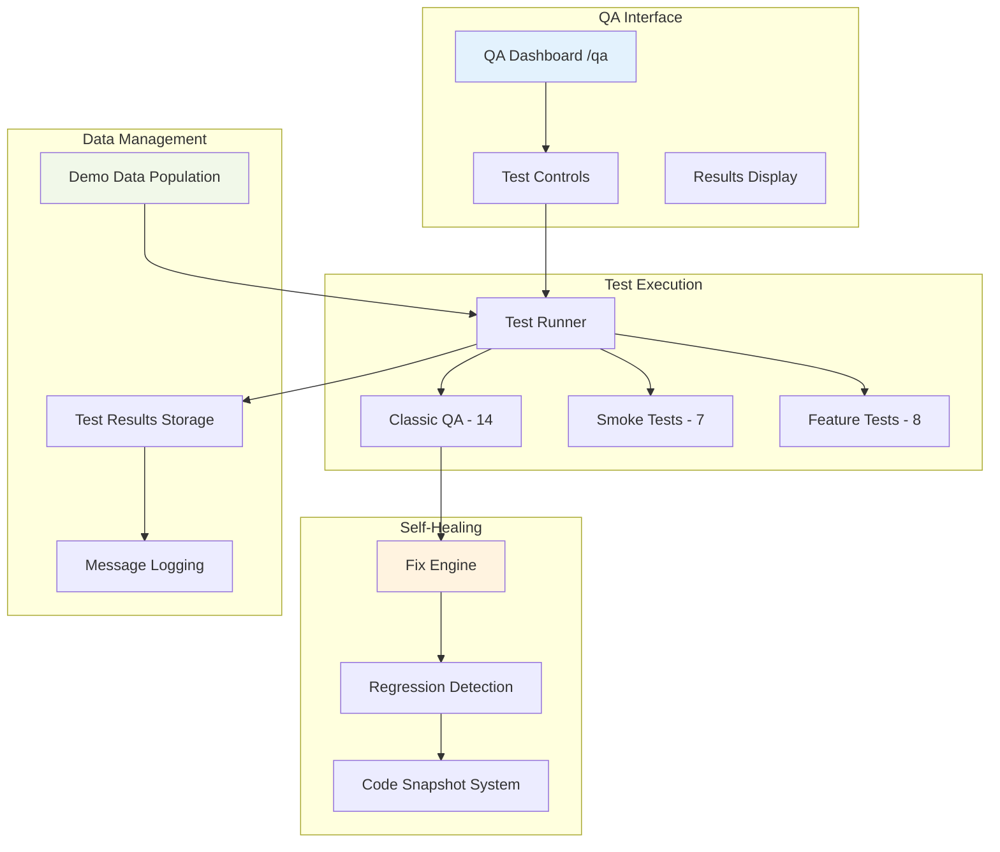
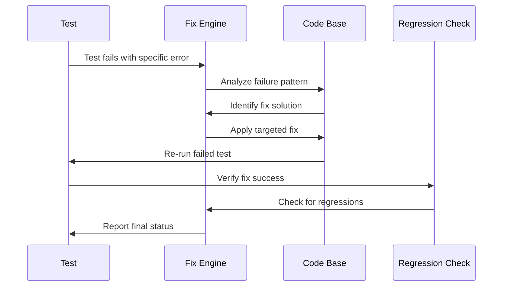

# HustleHub MVP - QA & Testing

## Overview

HustleHub includes a comprehensive Quality Assurance system with automated testing, self-healing capabilities, and production readiness validation. The QA harness consists of three distinct test suites covering different aspects of the system.

**Test Suite Summary:**
- **Classic QA Tests:** 14 tests covering core functionality
- **Smoke Tests:** 7 tests for basic system health  
- **Feature Tests:** 8 tests for MVP readiness

**Total Test Coverage:** 29 automated tests

## QA System Architecture



## Test Categories

### 1. Classic QA Tests (14 Tests)

**Purpose:** Validate core business logic and data flow integrity.

| Test ID | Test Name | Validates | Live Example |
|---------|-----------|-----------|--------------|
| DB_CONN | Database Connection | Supabase connectivity | Settings loaded: Freelancer Pro |
| COLLECTIONS_SANE | Collection Counts Sanity | Data access layer | 3 clients, 3 invoices, 2 tasks |
| QUICK_ACTIONS_LIVE | Quick Actions Use Live Data | Dashboard integration | 3 clients, 3 invoices, 2 upcoming tasks |
| INVOICE_DRAFT_HAS_ITEMS | Draft Invoice Has Items | Invoice creation workflow | Draft HH-2025-1004 has 2 items |
| INVOICE_SEND_CREATES_3_REMINDERS | Send Creates 3 Reminders | Reminder automation | HH-2025-1002 has 3 reminders at +3,+7,+14 days |
| FOLLOWUPS_SHOWS_PENDING | Follow-ups Show Pending | Follow-up filtering | 2 invoices with pending reminders |
| SEND_NOW_UPDATES_REMINDER | Send Now Updates State | Reminder workflow | Status → 'sent', log created |
| MARK_PAID_UPDATES_KPIS | Mark Paid Updates KPIs | Metrics calculation | ₹29,500 matches paid invoices |
| TASKS_ADD_AND_PERSIST | Add Task Persists | Task creation | QA test task found among 5 total |
| TASKS_MARK_DONE_PERSISTS | Mark Done Persists | Task completion | 1 completed task in system |
| BILLABLE_TASK_TO_INVOICE | Billable Task → Invoice | Workflow integration | Completed billable task linked to HH-2025-1001 |
| UPI_PREFERS_CLIENT | UPI Prefers Client VPA | Payment logic | Client acme@paytm overrides settings UPI |
| INVOICE_NUMBER_FORMAT | Invoice Number Format | Numbering scheme | HH-2025-1003 matches HH-YYYY-NNNN pattern |
| TASK_TO_INVOICE_FLOW | Task to Invoice Flow | Complete workflow | End-to-end billable task conversion |

### 2. Smoke Tests (7 Tests)

**Purpose:** Basic system health and critical path verification.

| Test Name | Purpose | Current Status |
|-----------|---------|----------------|
| Dashboard Sanity | Core metrics calculation | ✅ ₹29,500 paid, ₹11,800 overdue |
| Invoices List | Invoice CRUD operations | ✅ 3 invoices loaded successfully |
| Task CRUD | Task management basics | ✅ Task creation/completion working |
| Quick Actions Data | Dashboard data reflection | ✅ Live data in all quick actions |
| KPI Calculations | Metrics accuracy | ✅ Manual vs computed values match |
| Invoice Items | Line item management | ✅ Items properly associated |
| System Integrations | Component communication | ✅ All integrations functional |

### 3. Feature Tests (8 Tests)

**Purpose:** Production readiness and MVP completion validation.

| Feature | Test Status | Notes |
|---------|-------------|-------|
| Authentication | 🔄 Disabled (MVP) | No auth required in current version |
| Settings Management | ✅ Passed | Logo, UPI, GST configuration working |
| Client Management | ✅ Passed | CRUD operations complete |
| Invoice Workflows | ✅ Passed | Create, send, mark paid functional |
| Task Management | ✅ Passed | Task lifecycle working |
| Follow-up System | ✅ Passed | Reminder scheduling active |
| Dashboard | ✅ Passed | KPIs and quick actions operational |
| QA System | ✅ Passed | Self-testing capability functional |

## Running Tests

### Prerequisites

1. **Navigate to QA Page:**
   ```
   http://localhost:5173/qa
   ```

2. **Populate Demo Data:**
   - Click "Populate Demo Data" button
   - Ensures consistent test environment
   - Creates realistic sample data

3. **Verify Data Population:**
   - Check dashboard shows live metrics
   - Confirm invoices list has 3+ items
   - Validate tasks and clients exist

### Test Execution Methods

#### Run All Classic QA Tests
```javascript
// Via QA interface
handleRunAllTests()

// Expected output: 14/14 tests passed
// Execution time: ~30 seconds
// Creates comprehensive test report
```

#### Run Individual Test
```javascript
// Test specific functionality
handleRunSingleTest('MARK_PAID_UPDATES_KPIS')

// Useful for debugging specific issues
// Faster feedback cycle
```

#### Run Smoke Tests
```javascript
// Basic system health check
handleRunSmokeTests()

// Expected output: 7/7 tests passed  
// Quick validation of core functionality
```

#### Run Feature Tests
```javascript
// Production readiness check
handleRunFeatureTests()

// Expected output: 8/8 tests passed
// Validates MVP completion
```

### Test Data Management

#### Demo Data Population

**Automatically Creates:**
- **3 Clients:** Acme Studios, Bright Ideas, Creative Minds
- **3 Projects:** Website Revamp, Mobile App, Brand Refresh
- **3 Invoices:** HH-2025-1001 (paid), HH-2025-1002 (sent), HH-2025-1003 (overdue)
- **6 Invoice Items:** Various design and development services
- **3 Tasks:** Mix of billable and non-billable work
- **6 Reminders:** Scheduled follow-ups for sent invoices
- **Message Logs:** Communication history

**Data Characteristics:**
- Realistic business scenarios
- Consistent relationships (client → project → invoice)
- Date ranges spanning current month
- Amount totals matching dashboard KPIs

#### Reset and Re-populate

```javascript
// Clear existing demo data
handleResetDemoData()

// Re-create fresh demo data
handlePopulateDemoData()

// Useful for test isolation
```

## Self-Healing System

### Fix Mode Operation

**Enable Fix Mode:**
1. Toggle "Fix Mode" switch in QA interface
2. System enables automated fix application
3. Failed tests can trigger automatic repairs

**Fix Application Process:**


### Available Fixes

#### Invoice Creation Fix
**Problem:** Notes field causing database errors
**Solution:** Remove notes field from invoice payload
**Code Change:** 
```typescript
// Before (causing error)
const invoiceData = {
  // ... other fields
  notes: notes || null  // ❌ Column doesn't exist
};

// After (fixed)
const invoiceData = {
  // ... other fields
  // notes field removed ✅
};
```

#### Quick Actions Data Fix
**Problem:** Components using mock data instead of Supabase
**Solution:** Update components to use live collections
**Impact:** Ensures dashboard shows real-time data

#### Reminder Creation Fix  
**Problem:** Send invoice not creating proper reminders
**Solution:** Fix reminder scheduling logic
**Validation:** Verify 3 reminders at +3, +7, +14 days

#### Task Completion Fix
**Problem:** Mark done not persisting properly
**Solution:** Use proper enum casting for status updates
**Code Change:**
```sql
-- Fixed status update with proper enum casting
UPDATE tasks SET status = 'done'::task_status WHERE id = $1
```

### Regression Detection

**Automatic Regression Checking:**
1. Before applying any fix, system records passing tests
2. After fix application, re-runs previously passing tests
3. Detects if fix broke other functionality
4. Reverts changes if regressions detected

**Rollback Process:**
```javascript
// If regression detected
const regressionResult = await checkForRegressions(
  previouslyPassedIds, 
  fixedTestId
);

if (regressionResult.hasRegressions) {
  await revertSnapshot(fixedTestId);
  return { 
    applied: false, 
    notes: `Fix reverted due to regressions: ${regressionResult.notes}` 
  };
}
```

## Test Reports & Analytics

### Report Generation

#### Individual Test Report
```json
{
  "id": "MARK_PAID_UPDATES_KPIS",
  "name": "Mark Paid Updates KPIs", 
  "pass": true,
  "notes": "Metrics show ₹29,500, calculated ₹29,500",
  "executionTime": 250,
  "lastRun": "2025-08-12T19:05:54.466984+00:00",
  "fixApplied": false
}
```

#### Combined Test Summary
```json
{
  "timestamp": "2025-08-12T19:05:54.466984+00:00",
  "qaTests": {
    "totalTests": 14,
    "passed": 14,
    "failed": 0,
    "results": [...] 
  },
  "smokeTests": {
    "totalTests": 7,
    "passed": 7,
    "failed": 0
  },
  "featureTests": {
    "totalTests": 8,
    "passed": 8,
    "failed": 0
  },
  "summary": {
    "overallHealth": "excellent",
    "productionReady": true
  }
}
```

### Export Options

**JSON Export:**
- Complete test results with execution details
- Environment metadata (browser, URL, timestamp)
- Test history and trends
- Fix application logs

**CSV Export:** (Future enhancement)
- Test results in spreadsheet format
- Trend analysis over time
- Performance metrics

### Test History Tracking

**Persistent Storage:**
- Test results saved to localStorage
- Run history with timestamps
- Fix application tracking
- Performance trend data

**Historical Analysis:**
```javascript
// Get test performance over time
const history = qaTestRunner.getRunHistory();

// Analyze trends
const failureRates = history.map(run => ({
  date: run.executedAt,
  failureRate: run.failed / run.totalTests
}));
```

## Continuous Quality Assurance

### Automated Testing Schedule

**Manual Execution:** Tests run on-demand via QA interface
**Future Automation:** Planned integration with CI/CD pipeline

**Recommended Test Frequency:**
- **Smoke Tests:** After every deployment
- **Classic QA Tests:** Daily during development
- **Feature Tests:** Weekly for production readiness
- **Full Suite:** Before major releases

### Quality Gates

**Development Quality Gate:**
- All Classic QA tests must pass
- No failing smoke tests
- Fix mode disabled for production testing

**Production Readiness Gate:**
- All 29 tests passing
- Feature tests validate MVP completion
- Performance benchmarks met
- No pending regressions

### Integration with Development Workflow

**Pre-Deployment Checklist:**
1. Run "Populate Demo Data"
2. Execute full test suite (Classic + Smoke + Feature)
3. Verify 29/29 tests passing
4. Export test report for documentation
5. Clear fix mode for production testing

**Post-Deployment Verification:**
1. Run smoke tests on live environment
2. Validate KPIs with real data
3. Confirm all integrations functional
4. Monitor for any regression issues

## Troubleshooting Test Issues

### Common Test Failures

#### Database Connection Issues
**Symptoms:** DB_CONN test fails
**Solutions:** 
- Verify Supabase URL and API key
- Check network connectivity
- Confirm database is accessible

#### Demo Data Missing
**Symptoms:** Multiple tests fail with "no data found"
**Solutions:**
- Run "Populate Demo Data" first
- Check database permissions
- Verify table structure

#### Stale Cache Issues
**Symptoms:** Tests pass but UI shows old data
**Solutions:**
- Clear React Query cache
- Hard refresh browser
- Restart development server

#### Fix Mode Issues
**Symptoms:** Fixes not applying or causing regressions
**Solutions:**
- Disable and re-enable fix mode
- Clear test snapshots
- Review fix implementation logic

### Debug Mode

**Enable Detailed Logging:**
```javascript
// In browser console
localStorage.setItem('qa:debug', 'true');

// Provides detailed test execution logs
// Shows fix application steps
// Displays cache invalidation events
```

**Test Isolation:**
```javascript
// Run single test with full logging
qaTestRunner.setFixMode(false);  // Disable fixes for debugging
const result = await qaTestRunner.runSingleTest('TEST_ID');
console.log('Detailed result:', result);
```

## Future Enhancements

### Advanced Testing Features

**Performance Testing:**
- Load testing for high-volume scenarios
- Database query performance validation
- UI responsiveness benchmarks

**Integration Testing:**
- External API integration validation
- Payment gateway testing (when implemented)
- Email/SMS delivery verification

**Security Testing:**
- RLS policy validation (Phase 2)
- Authentication flow testing
- Data access permission verification

### Test Automation

**CI/CD Integration:**
- Automated test execution on code changes
- Test result integration with deployment pipeline
- Quality gate enforcement for releases

**Scheduled Testing:**
- Nightly full test suite execution
- Weekly production health checks
- Monthly comprehensive validation

### Enhanced Reporting

**Visual Test Reports:**
- Test result dashboards
- Trend analysis charts
- Performance metrics visualization

**Stakeholder Reports:**
- Executive summary of system health
- Business impact of test failures
- Quality metrics and KPIs
