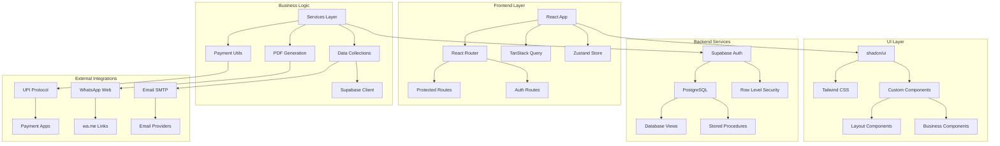
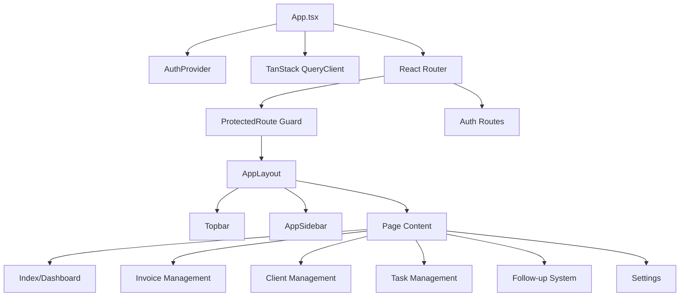
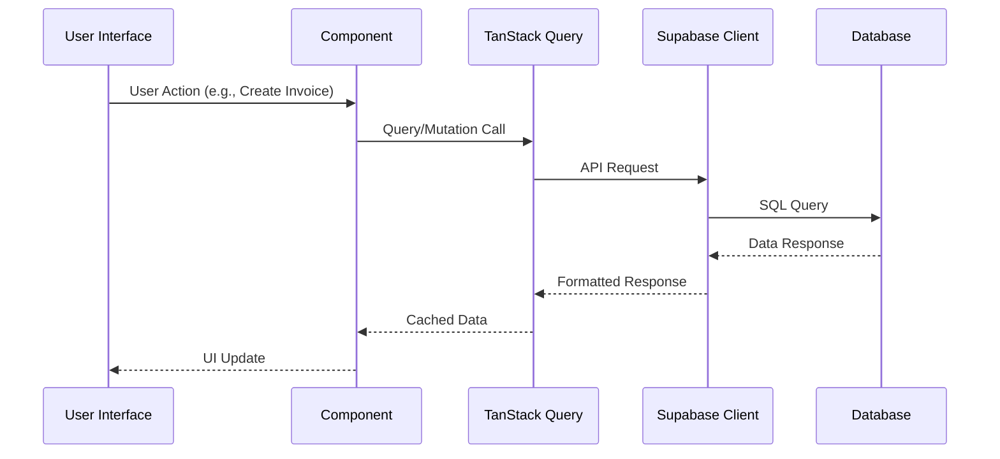
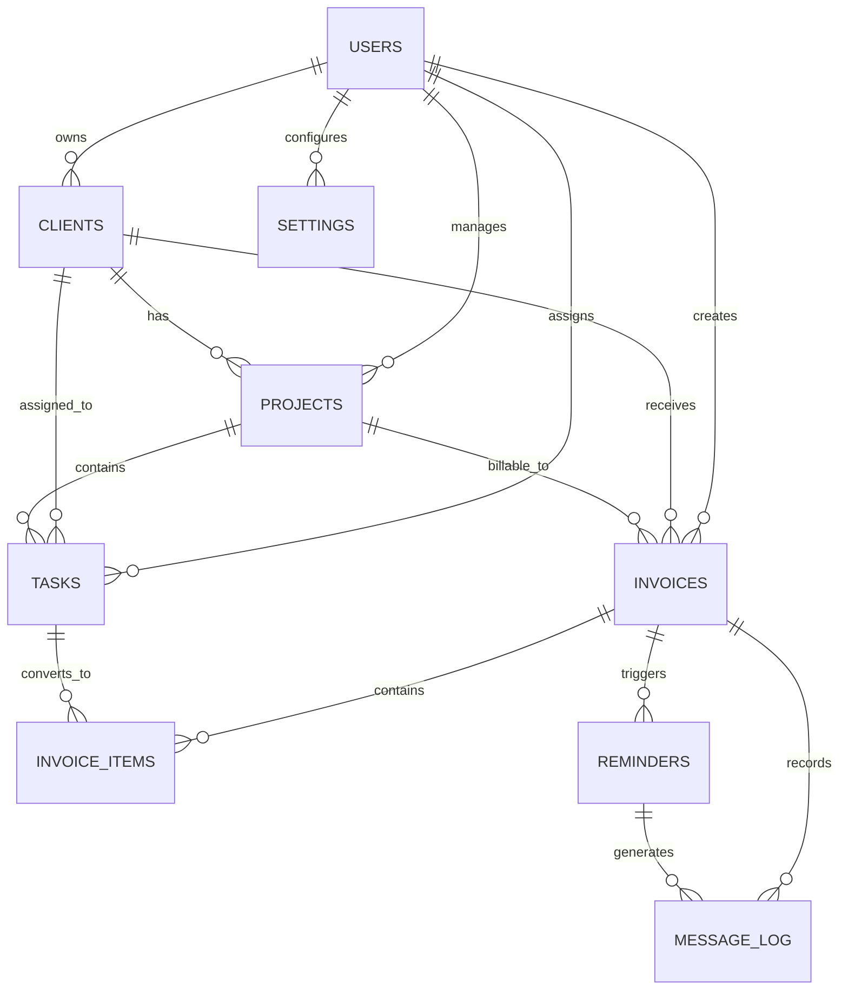
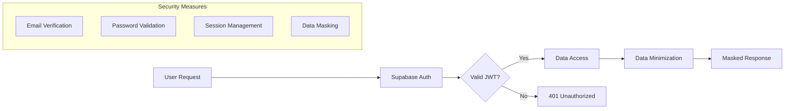
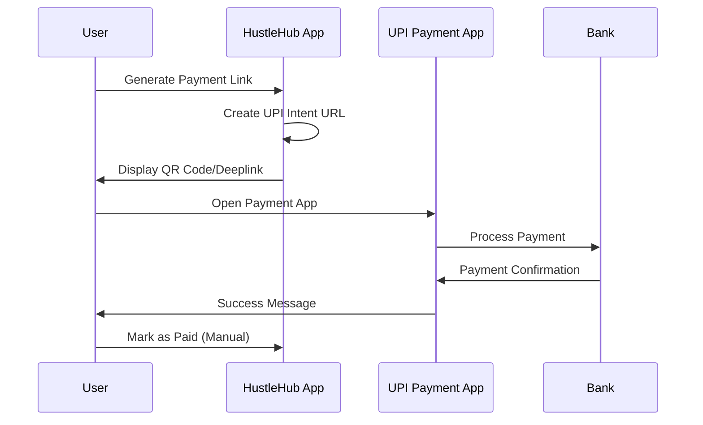
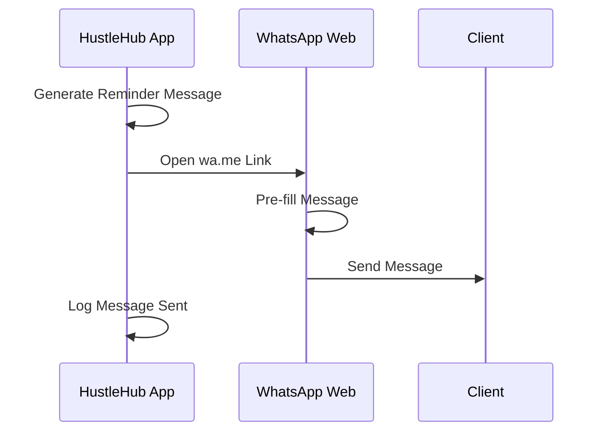
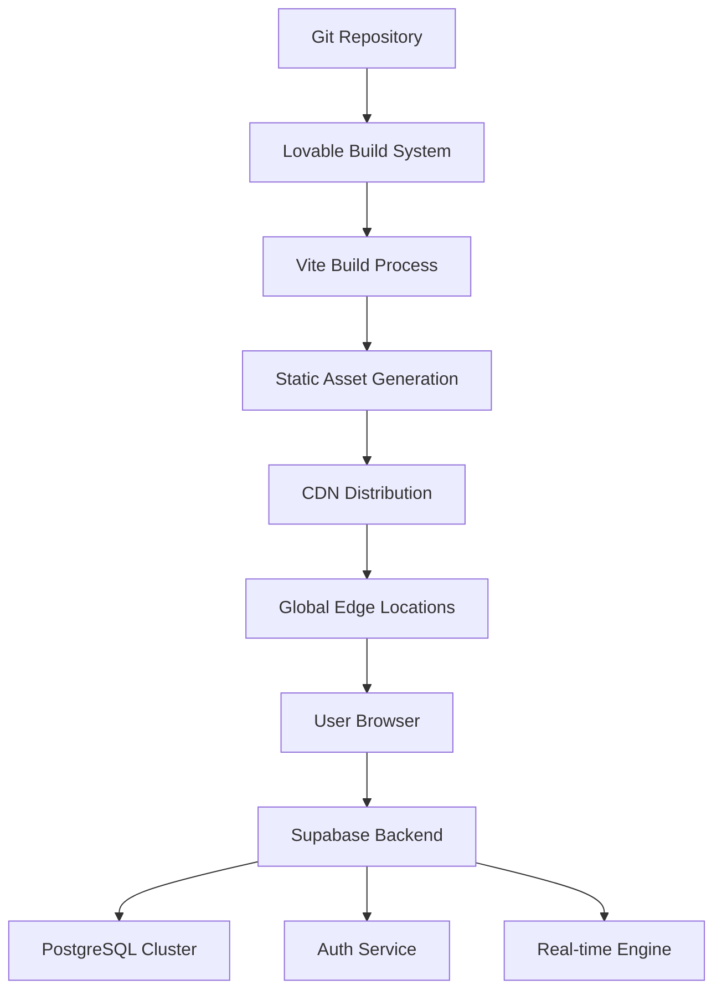

# HustleHub — System Architecture

**Framework**: React 18 + TypeScript + Vite  
**Backend**: Supabase (PostgreSQL + Auth + Storage)  
**Deployment**: Lovable Platform  
**Last Updated**: 2025-01-02

## 🏗 High-Level Architecture

## 📁 Component Architecture

### Core Application Structure

### Data Flow Architecture

## 🗂 Page Structure & Routes

| Route | Component | Purpose | Auth Required |
|-------|-----------|---------|---------------|
| `/` | `Index.tsx` | Dashboard with metrics | ✅ |
| `/auth/signin` | `SignIn.tsx` | User authentication | ❌ |
| `/auth/signup` | `SignUp.tsx` | User registration | ❌ |
| `/auth/reset-password` | `ResetPassword.tsx` | Password recovery | ❌ |
| `/clients` | `Clients.tsx` | Client management | ✅ |
| `/invoices` | `InvoicesList.tsx` | Invoice listing | ✅ |
| `/invoices/new` | `CreateInvoice.tsx` | Invoice creation | ✅ |
| `/invoices/edit/:id` | `EditInvoice.tsx` | Invoice editing | ✅ |
| `/tasks` | `Tasks.tsx` | Task management | ✅ |
| `/projects` | `Projects.tsx` | Project overview | ✅ |
| `/follow-ups` | `FollowUps.tsx` | Reminder management | ✅ |
| `/savings` | `SavingsGoals.tsx` | Savings tracking | ✅ |
| `/settings` | `Settings.tsx` | App configuration | ✅ |
| `/qa` | `QA.tsx` | Testing interface | ✅ |

## 🔧 Technology Stack Details

### Frontend Technologies
- **React 18**: Latest React with Concurrent Features
- **TypeScript**: Full type safety and developer experience
- **Vite**: Fast build tool with HMR and optimized bundles
- **React Router v6**: Client-side routing with nested routes
- **TanStack Query**: Server state management with caching
- **Zustand**: Lightweight client state management

### UI Framework
- **Tailwind CSS**: Utility-first CSS framework
- **shadcn/ui**: High-quality component library
- **Radix UI**: Accessible component primitives
- **Lucide React**: Consistent icon system
- **Framer Motion**: Animation and gesture library

### Backend Integration
- **Supabase**: Backend-as-a-Service platform
  - **PostgreSQL**: Relational database with JSON support
  - **Auth**: Email/password authentication with JWTs
  - **Real-time**: WebSocket subscriptions for live updates
  - **Storage**: File upload and CDN capabilities

### Specialized Libraries
- **jsPDF**: Client-side PDF generation
- **html2canvas**: DOM to canvas conversion
- **qrcode.react**: QR code generation for UPI payments
- **date-fns**: Date manipulation and formatting
- **react-hook-form**: Form validation and management

## 🏛 Database Architecture

### Core Entities

### Database Views
- **`v_dashboard_metrics`**: Aggregated business metrics
  - `this_month_paid`: Revenue for current month
  - `overdue_amount`: Total outstanding payments
  - `tasks_due_7d`: Upcoming task deadlines

## 🔐 Security Architecture

### Phase 1: Single-User Security

### Phase 2: Multi-User Security (Planned)
- **Row Level Security (RLS)**: Data isolation between users
- **Role-Based Access Control**: Admin/Member/Client permissions
- **Audit Logging**: Complete action tracking
- **Data Encryption**: Sensitive field encryption at rest

## 🔄 State Management Strategy

### Server State (TanStack Query)
- **Invoice Data**: Cached with automatic refresh
- **Client Information**: Background updates with optimistic UI
- **Dashboard Metrics**: Polling for real-time updates
- **Settings**: Persistent cache with manual invalidation

### Client State (Zustand)
- **UI Preferences**: Theme, sidebar state, view modes
- **Form Data**: Multi-step forms and draft states
- **Temporary Data**: Search filters, modal states
- **Cache Keys**: Query invalidation coordination

## 🌐 Integration Architecture

### UPI Payment Flow

### WhatsApp Integration

## ⚡ Performance Optimizations

### Frontend Optimizations
- **Code Splitting**: Lazy-loaded routes and components
- **Image Optimization**: Responsive images with lazy loading
- **Bundle Analysis**: Tree shaking and dead code elimination
- **Caching Strategy**: Service worker for offline functionality

### Database Optimizations
- **Indexes**: Optimized queries for common access patterns
- **Views**: Pre-computed aggregations for dashboard metrics
- **Connection Pooling**: Efficient database connection management
- **Query Optimization**: Selective field loading and joins

## 🚀 Deployment Architecture

### Lovable Platform Deployment

### Environment Configuration
- **Development**: Local Vite server with hot reload
- **Staging**: Lovable preview deployments for testing
- **Production**: Optimized builds with caching and compression

## 🔧 Development Workflow

### Code Organization Principles
1. **Feature-Based Structure**: Components grouped by business domain
2. **Separation of Concerns**: UI, business logic, and data layers distinct
3. **Type Safety**: Comprehensive TypeScript coverage
4. **Reusability**: Shared components and utility functions
5. **Testing**: Built-in QA framework with automated validation

### Build & Deploy Pipeline
1. **Local Development**: `npm run dev` with instant HMR
2. **Type Checking**: `tsc --noEmit` for compile-time validation
3. **Linting**: ESLint for code quality enforcement
4. **Testing**: Built-in QA suite for regression testing
5. **Deployment**: Automatic builds on code changes via Lovable