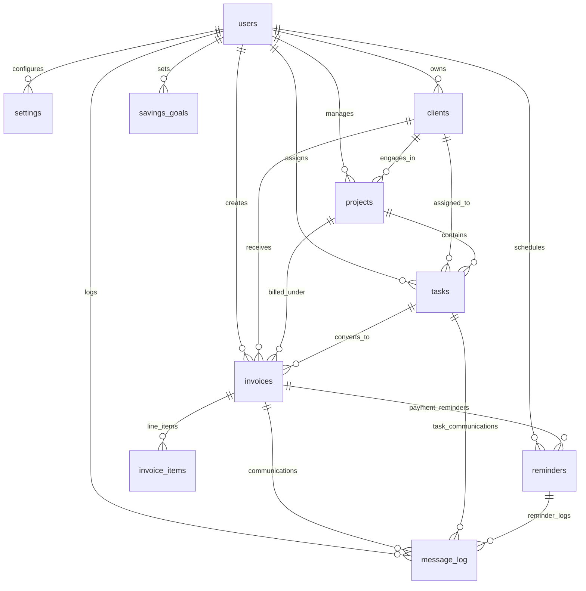
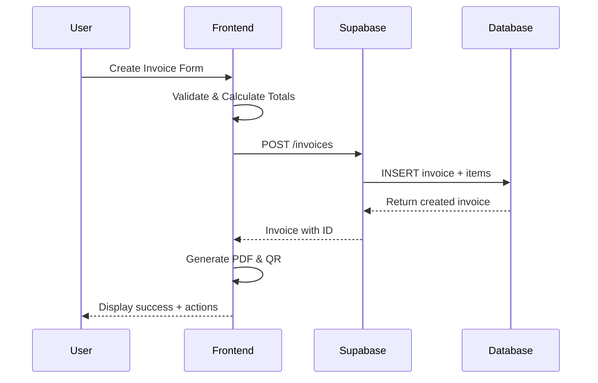
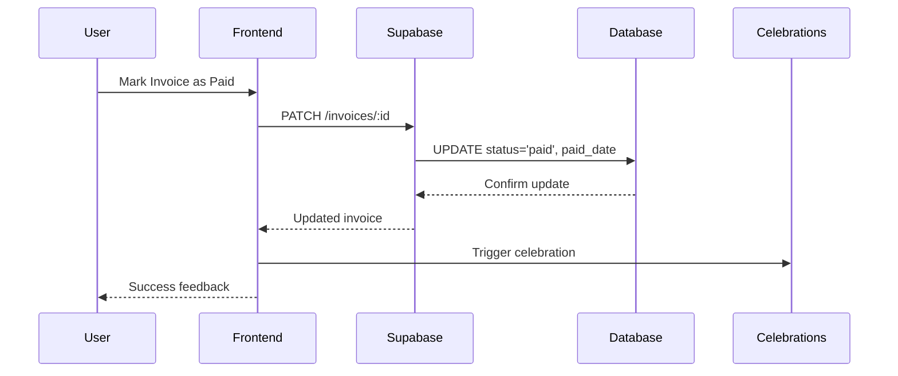

# HustleHub — Data Model & Schema

**Database**: PostgreSQL (via Supabase)  
**Current Phase**: Single-user architecture  
**Planned**: Multi-user with Row Level Security (RLS)  
**Last Updated**: 2025-01-02

## 🗃 Entity Relationship Diagram



## 📊 Core Entities

### 👤 Users (Managed by Supabase Auth)
```sql
-- Supabase auth.users table (read-only)
id: uuid (primary key)
email: text (unique, not null)
email_confirmed_at: timestamp
created_at: timestamp
updated_at: timestamp
```

### ⚙️ Settings
Business configuration and preferences for each user.

```sql
CREATE TABLE settings (
  id: bigint (primary key)
  owner_id: uuid (references auth.users)
  creator_display_name: text (default: 'HustleHub Demo')
  company_name: text
  gstin: text
  company_address: text
  footer_message: text
  logo_url: text
  upi_vpa: text (default: 'tushar@upi')
  default_gst_percent: numeric (default: 18)
  invoice_prefix: text (default: 'HH')
  created_at: timestamp (default: now())
);
```

**Key Relationships**: One settings record per user  
**Business Logic**: UPI VPA required for payment generation  
**Validation**: GSTIN checksum validation in frontend

### 👥 Clients
Customer database with contact and billing information.

```sql
CREATE TABLE clients (
  id: uuid (primary key, default: gen_random_uuid())
  owner_id: uuid (references auth.users)
  name: text (not null)
  whatsapp: text
  email: text
  address: text
  gstin: text
  upi_vpa: text
  suggested_hour: time
  created_at: timestamp (default: now())
);
```

**Key Fields**:
- `whatsapp`: Phone number for WhatsApp reminders
- `suggested_hour`: Preferred time for automated follow-ups
- `gstin`: For B2B invoicing and tax compliance
- `upi_vpa`: Client's UPI ID for payment requests

**Privacy Controls**: Sensitive fields (email, phone) masked in list views

### 🏢 Projects
Organizational structure for grouping work and invoices.

```sql
CREATE TABLE projects (
  id: uuid (primary key, default: gen_random_uuid())
  owner_id: uuid (references auth.users)
  client_id: uuid (references clients)
  name: text (not null)
  is_billable: boolean (default: true)
  created_at: timestamp (default: now())
);
```

**Status**: Basic structure implemented, UI components in progress  
**Usage**: Groups tasks and invoices under client engagements

### 📄 Invoices
Core billing documents with comprehensive status tracking.

```sql
CREATE TABLE invoices (
  id: uuid (primary key, default: gen_random_uuid())
  owner_id: uuid (references auth.users)
  client_id: uuid (references clients)
  project_id: uuid (references projects)
  invoice_number: text (not null)
  issue_date: date (default: CURRENT_DATE)
  due_date: date (not null)
  subtotal: numeric (default: 0)
  gst_amount: numeric (default: 0)
  total_amount: numeric (not null)
  status: invoice_status (default: 'draft')
  paid_date: date
  utr_reference: text
  share_url: text
  pdf_url: text
  upi_qr_svg: text
  created_at: timestamp (default: now())
);

-- Status enum
CREATE TYPE invoice_status AS ENUM ('draft', 'sent', 'overdue', 'paid');
```

**Key Features**:
- **Auto-numbering**: Generated from settings.invoice_prefix
- **Status Workflow**: Draft → Sent → Overdue/Paid
- **Payment Tracking**: UTR reference for bank reconciliation
- **Document Storage**: PDF and QR code caching

### 📝 Invoice Items
Line items for detailed billing breakdown.

```sql
CREATE TABLE invoice_items (
  id: uuid (primary key, default: gen_random_uuid())
  owner_id: uuid (references auth.users)
  invoice_id: uuid (references invoices, on delete cascade)
  title: text (not null)
  qty: integer (default: 1)
  rate: numeric (default: 0)
  amount: numeric (not null) -- Calculated: qty * rate
);
```

**Calculations**: Frontend computes amount, GST, and totals  
**Constraints**: Amount must match qty × rate

### ✅ Tasks
Work tracking with billable hour management.

```sql
CREATE TABLE tasks (
  id: uuid (primary key, default: gen_random_uuid())
  owner_id: uuid (references auth.users)
  client_id: uuid (references clients)
  project_id: uuid (references projects)
  linked_invoice_id: uuid (references invoices)
  title: text (not null)
  notes: text
  due_date: date
  reminder_time: time
  is_billable: boolean (default: false)
  status: task_status (default: 'open')
  created_at: timestamp (default: now())
);

-- Status enum  
CREATE TYPE task_status AS ENUM ('open', 'done');
```

**Workflow**: Tasks can be converted to invoice line items  
**Integration**: Links to invoices for billable work tracking

### 🔔 Reminders
Automated follow-up scheduling for payments.

```sql
CREATE TABLE reminders (
  id: uuid (primary key, default: gen_random_uuid())
  owner_id: uuid (references auth.users)
  invoice_id: uuid (references invoices, on delete cascade)
  scheduled_at: timestamp (not null)
  channel: channel_type (default: 'whatsapp')
  status: reminder_status (default: 'pending')
  created_at: timestamp (default: now())
);

-- Channel enum
CREATE TYPE channel_type AS ENUM ('whatsapp', 'email');

-- Status enum
CREATE TYPE reminder_status AS ENUM ('pending', 'sent', 'skipped');
```

**Automation**: Scheduled T-3 days, due date, +7 days  
**Channels**: WhatsApp (implemented), Email (planned)

### 📧 Message Log
Communication history and audit trail.

```sql
CREATE TABLE message_log (
  id: uuid (primary key, default: gen_random_uuid())
  owner_id: uuid (references auth.users)
  related_type: text (not null) -- 'invoice' or 'task'
  related_id: uuid (not null)
  channel: channel_type
  template_used: text
  outcome: text
  sent_at: timestamp (default: now())
);
```

**Purpose**: Track all client communications for audit and analysis  
**Usage**: Links to invoices, tasks, and reminders

### 💰 Savings Goals
Financial target tracking and motivation.

```sql
CREATE TABLE savings_goals (
  id: uuid (primary key, default: gen_random_uuid())
  title: text (not null)
  target_amount: numeric (not null)
  saved_amount: numeric (default: 0)
  target_date: date
  type: text
  created_at: timestamp (default: now())
);
```

**Note**: Currently single-user, will add owner_id for multi-user support

## 📊 Database Views

### Dashboard Metrics View
Pre-computed business analytics for performance.

```sql
CREATE VIEW v_dashboard_metrics AS
SELECT 
  COALESCE(SUM(CASE 
    WHEN status = 'paid' 
    AND paid_date >= date_trunc('month', CURRENT_DATE)
    THEN total_amount 
  END), 0) as this_month_paid,
  
  COALESCE(SUM(CASE 
    WHEN status IN ('sent', 'overdue') 
    THEN total_amount 
  END), 0) as overdue_amount,
  
  (SELECT COUNT(*) 
   FROM tasks 
   WHERE status = 'open' 
   AND due_date BETWEEN CURRENT_DATE AND CURRENT_DATE + INTERVAL '7 days'
  ) as tasks_due_7d
FROM invoices;
```

## 🔒 Security Model

### Phase 1: Single-User Architecture
```sql
-- Simple policies allowing all access for authenticated users
CREATE POLICY "Allow all access" ON invoices FOR ALL USING (true);
CREATE POLICY "Allow all access" ON clients FOR ALL USING (true);
CREATE POLICY "Allow all access" ON tasks FOR ALL USING (true);
-- Similar for all tables
```

**Current State**: All authenticated users can access all data  
**Justification**: MVP single-user simplicity

### Phase 2: Multi-User with RLS (Planned)
```sql
-- Example future policies for data isolation
CREATE POLICY "Users can only see their own invoices" 
ON invoices FOR ALL 
USING (auth.uid() = owner_id);

CREATE POLICY "Users can only see their own clients" 
ON clients FOR ALL 
USING (auth.uid() = owner_id);

-- Similar owner_id-based policies for all user data
```

**Planned Security**:
- **Data Isolation**: Users can only access their own records
- **Role-Based Access**: Admin/Member/Client permission levels
- **Audit Logging**: Complete action tracking
- **Field Encryption**: Sensitive data encryption at rest

## 🔄 Data Flow Patterns

### Invoice Creation Flow


### Payment Status Update


## 📈 Performance Considerations

### Database Optimization
- **Indexes**: All foreign keys and frequently queried fields
- **Views**: Pre-computed aggregations for dashboard metrics
- **Pagination**: Large lists use cursor-based pagination
- **Caching**: TanStack Query caches responses with TTL

### Data Minimization
- **List Endpoints**: Exclude sensitive fields (email, phone, GSTIN)
- **Detail Endpoints**: Full data only when explicitly requested
- **Masking Utilities**: Frontend helpers for privacy display

### Scaling Strategy
- **Horizontal Scaling**: Supabase handles database clustering
- **Connection Pooling**: Built-in connection management
- **Read Replicas**: Planned for analytics and reporting queries
- **Archival**: Old invoice data moved to cold storage

## 🔍 Data Analytics

### Key Metrics Tracked
- **Revenue Analytics**: Monthly payments, growth trends
- **Client Behavior**: Payment patterns, communication frequency
- **Invoice Performance**: Time to payment, overdue rates
- **User Engagement**: Feature usage, session duration

### Reporting Capabilities
- **Financial Reports**: Revenue, outstanding, overdue analysis
- **Client Reports**: Payment history, relationship health
- **Operational Reports**: Task completion, follow-up effectiveness
- **Business Intelligence**: Predictive payment collection

## 🚧 Migration Strategy

### Schema Evolution
```sql
-- Example migration for multi-user support
ALTER TABLE invoices ADD COLUMN owner_id uuid REFERENCES auth.users;
UPDATE invoices SET owner_id = (SELECT id FROM auth.users LIMIT 1);
ALTER TABLE invoices ALTER COLUMN owner_id SET NOT NULL;

-- Enable RLS
ALTER TABLE invoices ENABLE ROW LEVEL SECURITY;
```

### Data Migration Plan
1. **Backup**: Full database snapshot before changes
2. **Owner Assignment**: Assign existing data to first user
3. **Policy Creation**: Implement RLS policies gradually
4. **Testing**: Validate data access patterns
5. **Rollback Plan**: Quick revert strategy if issues arise