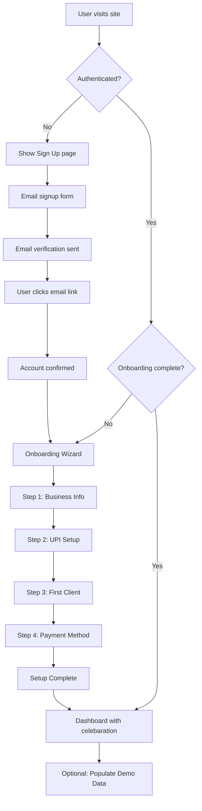
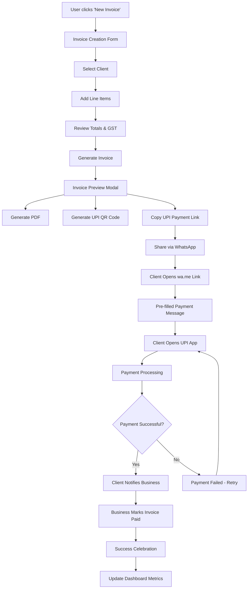
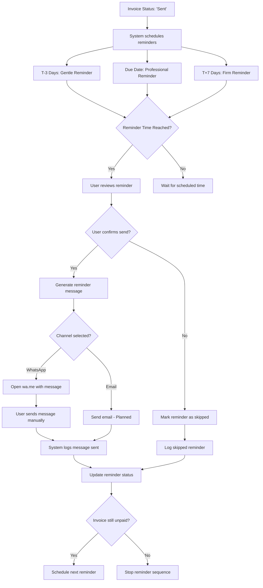
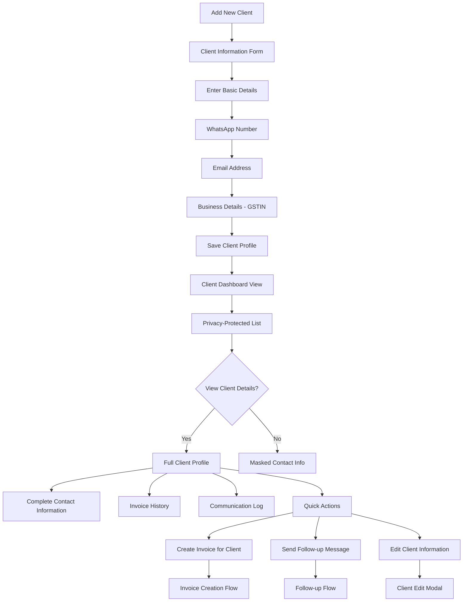
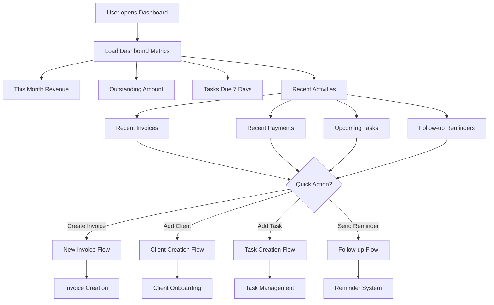
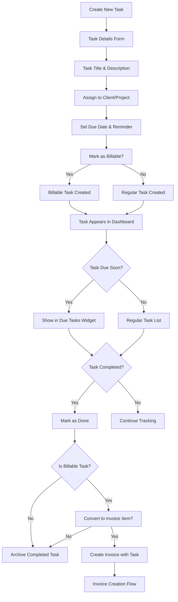
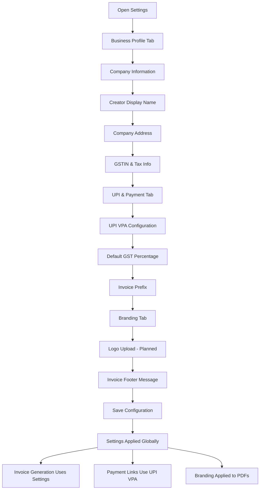
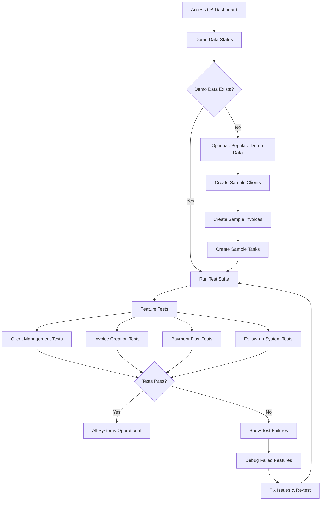
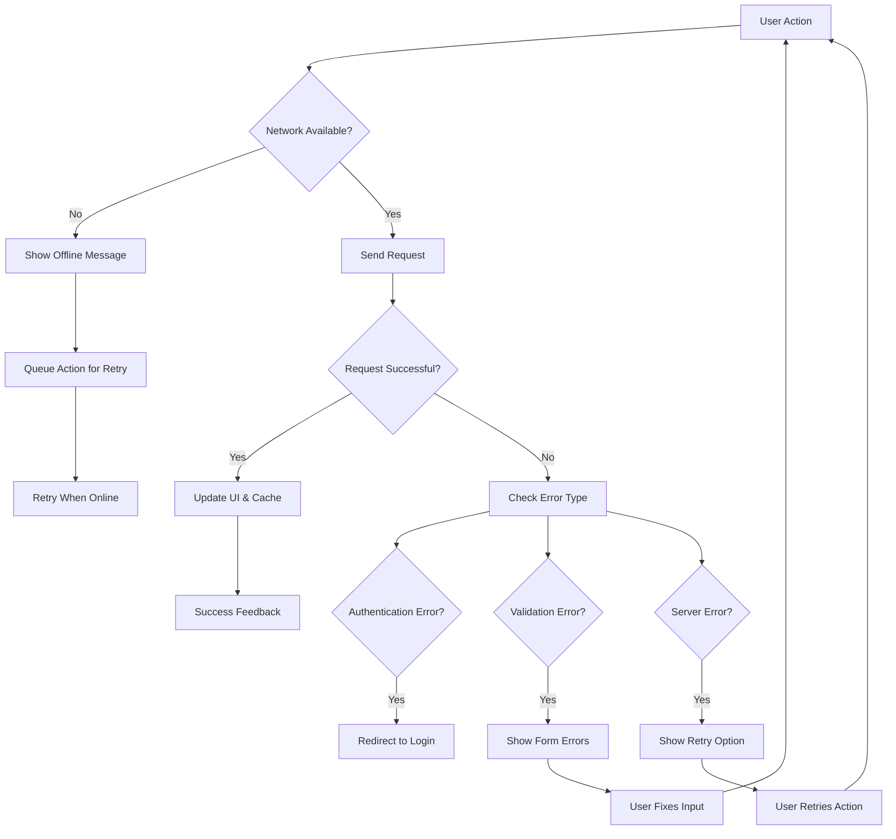
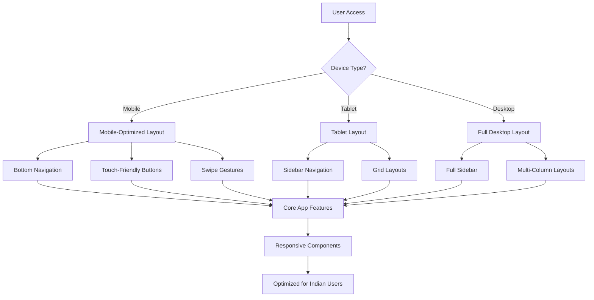

# HustleHub — User Flows & Workflows

**Purpose**: Document key user journeys with visual flowcharts and screen references  
**Target Users**: Indian freelancers and small business owners  
**Last Updated**: 2025-01-02

## 🚀 First-Time User Experience (FTUX)

### Onboarding Flow

**Key Screens**:
- `/auth/signup` - `SignUp.tsx`
- `/auth/signin` - `SignIn.tsx`  
- `/` - `Index.tsx` with `OnboardingWizard.tsx`

**Business Logic**:
- Email verification required before app access
- Onboarding wizard tracks completion state
- Demo data population is optional
- Celebration system rewards setup completion

## 💰 Core Invoice-to-Payment Workflow

### Invoice Creation & Payment Collection

**Key Screens**:
- `/invoices/new` - `CreateInvoice.tsx`
- `/invoices` - `InvoicesList.tsx`
- Modal: `InvoicePreviewModal.tsx`

**Integration Points**:
- **UPI Protocol**: `services/payments.ts` - `buildUpiIntent()`
- **PDF Generation**: `lib/pdfGenerator.ts`
- **WhatsApp**: `buildWhatsAppUrl()` for wa.me links
- **Celebrations**: `CelebrationProvider.tsx`

## 🔔 Automated Follow-up System

### Payment Reminder Cadence

**Key Screens**:
- `/follow-ups` - `FollowUps.tsx`
- Modal: `QuickFollowupModal.tsx`
- Drawer: `FollowUpPreviewDrawer.tsx`

**Automation Logic**:
- **Scheduling**: Automatic T-3, Due, +7 day reminders
- **Templates**: Gentle → Professional → Firm escalation
- **Channels**: WhatsApp (implemented), Email (planned)
- **Tracking**: Complete message history in `message_log`

## 👥 Client Management Flow

### Client Onboarding & Communication

**Key Components**:
- `/clients` - `Clients.tsx`
- Modal: `AddClientModal.tsx`, `EditClientModal.tsx`
- Detail: `ClientDetails.tsx`

**Privacy Features**:
- **Data Masking**: Email and phone numbers masked in list views
- **Detail Access**: Full information only in detail modals
- **Secure Storage**: Sensitive data properly stored and retrieved

## 📊 Dashboard & Analytics Flow

### Business Metrics & Quick Actions

**Key Components**:
- `/` - `Index.tsx` (Dashboard)
- Widget: `QuickActionsWidget.tsx`
- Data: `v_dashboard_metrics` view

**Real-time Updates**:
- **TanStack Query**: Automatic cache invalidation
- **Optimistic Updates**: Instant UI feedback
- **Background Refresh**: Polling for real-time metrics

## ✅ Task Management Flow

### Billable Work Tracking

**Key Components**:
- `/tasks` - `Tasks.tsx`
- Modal: `AddTaskModal.tsx`

**Business Integration**:
- **Billable Tracking**: Links to invoice creation
- **Project Association**: Groups tasks under client projects
- **Deadline Management**: Due date alerts and reminders

## ⚙️ Settings & Configuration Flow

### Business Setup & Customization

**Key Components**:
- `/settings` - `Settings.tsx`
- Data: `settings` table

**Configuration Impact**:
- **Invoice Generation**: All invoices use saved settings
- **Payment Integration**: UPI VPA required for payment links
- **Branding**: Company info appears on all documents

## 🧪 Quality Assurance Flow

### Built-in Testing System

**Key Components**:
- `/qa` - `QA.tsx`
- Framework: `qa/featureTests.ts`, `qa/testRunner.ts`

**Testing Strategy**:
- **Feature Validation**: End-to-end workflow testing
- **Data Independence**: Tests skip gracefully without demo data
- **Regression Prevention**: Automated validation on changes

## 🔄 Error Handling & Recovery

### Graceful Failure Management

**Error Handling Strategy**:
- **Toast Notifications**: User-friendly error messages
- **Optimistic Updates**: Instant UI feedback with rollback
- **Retry Logic**: Automatic and manual retry options
- **Graceful Degradation**: Core features work even with limited connectivity

## 📱 Mobile-First Experience

### Responsive Design Patterns

**Mobile Optimizations**:
- **Touch Targets**: 44px minimum touch targets
- **Thumb Navigation**: Bottom-aligned primary actions
- **Readable Text**: 16px base font size, good contrast
- **Fast Loading**: Optimized images and lazy loading
- **Offline Support**: Core features work without connectivity