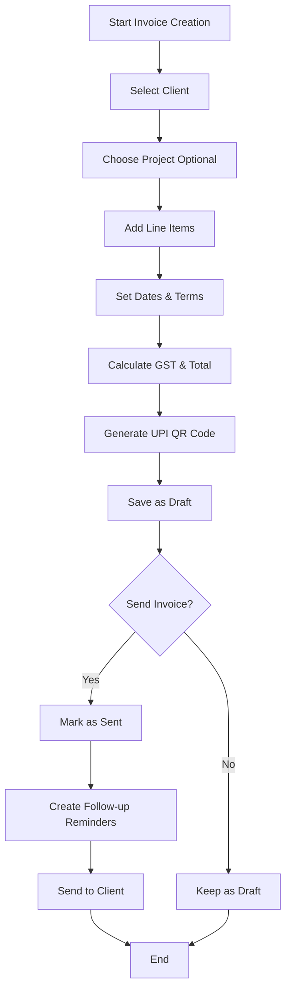
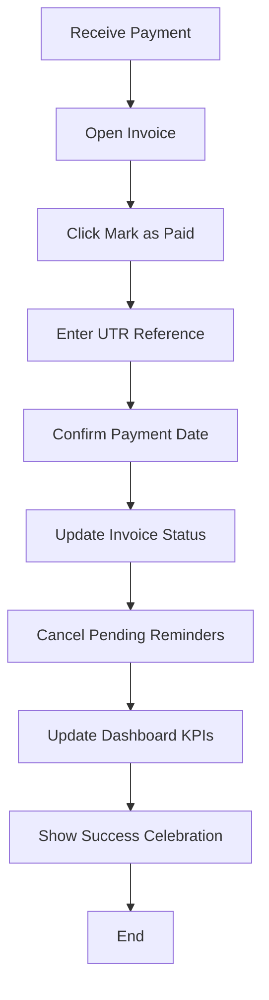
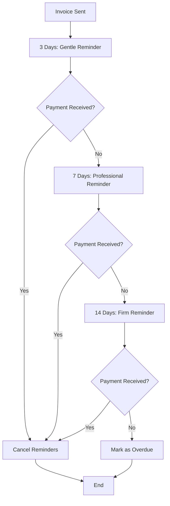
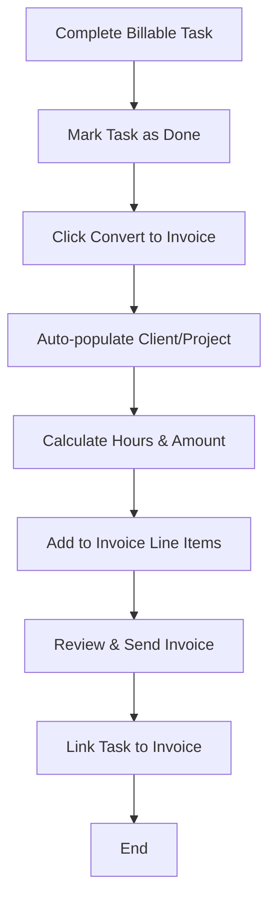
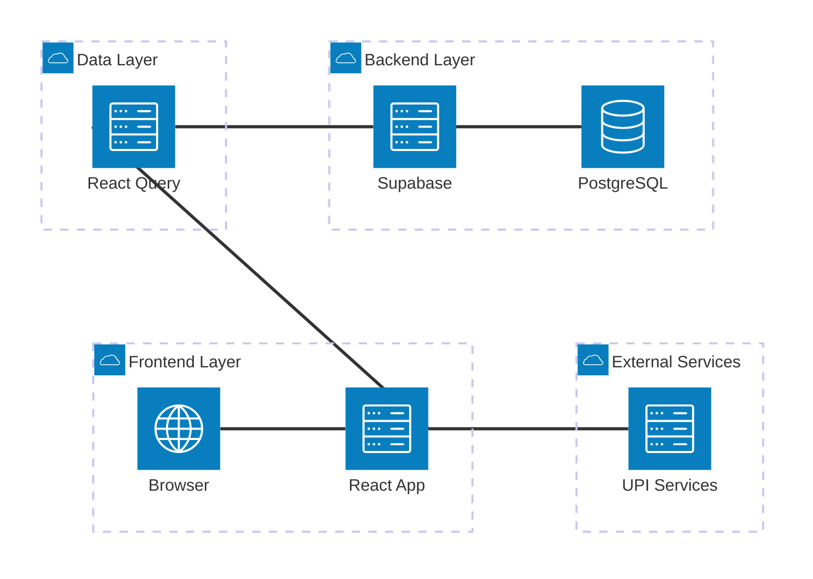
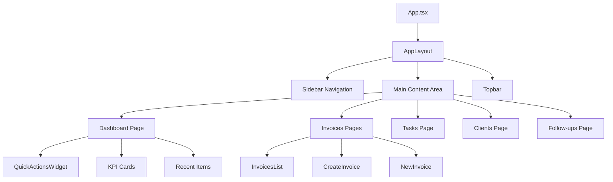
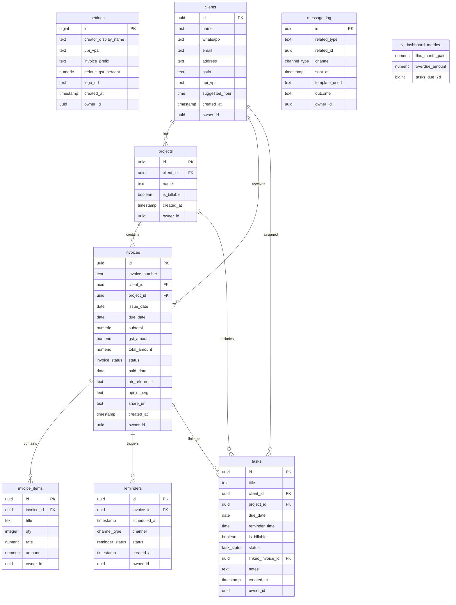

<!-- TODO: Replace with actual logo when available at /public/brand/hustlehub-logo.png -->


# HustleHub MVP – Complete Documentation

**A streamlined invoice management system for freelancers and small businesses**

## Table of Contents

1. [Product Overview](#product-overview)
2. [Target Users & Use Cases](#target-users--use-cases)
3. [Core Features](#core-features)
4. [User Workflows](#user-workflows)
5. [Technical Architecture](#technical-architecture)
6. [Technology Stack](#technology-stack)
7. [Database Schema & Data Model](#database-schema--data-model)
8. [API Reference](#api-reference)
9. [Implementation Details](#implementation-details)
10. [Quality Assurance](#quality-assurance)
11. [Setup & Operations](#setup--operations)
12. [Known Limitations](#known-limitations)
13. [Future Roadmap](#future-roadmap)

---

## Product Overview

HustleHub MVP is a comprehensive invoice management system designed specifically for freelancers and small businesses operating in the Indian market. The application streamlines the entire invoicing lifecycle from creation to payment tracking, with integrated UPI payment support, automated follow-ups, and task management capabilities.

### Key Value Propositions

- **Streamlined Invoicing**: Professional invoice generation with GST compliance
- **UPI Integration**: Native UPI QR code generation for instant payments
- **Automated Follow-ups**: Three-stage reminder system via WhatsApp and email
- **Task to Invoice**: Convert billable tasks directly into invoices
- **Real-time Dashboard**: Live KPIs and business health metrics
- **Zero Setup**: Pre-configured with Indian market defaults

---

## Target Users & Use Cases

### Primary Users

**Freelancers & Consultants**
- Individual service providers
- Creative professionals (designers, developers, writers)
- Business consultants and advisors

**Small Businesses**
- Agencies with 1-10 employees
- Service-based businesses
- Project-based organizations

### Core Use Cases

1. **Invoice Management**: Create, send, and track professional invoices
2. **Payment Tracking**: Monitor payments with UPI integration
3. **Client Relationship**: Manage client details and project associations
4. **Task Billing**: Track billable work and convert to invoices
5. **Follow-up Automation**: Automated reminder system for overdue payments
6. **Business Analytics**: Dashboard with revenue and performance metrics

---

## Core Features

### 1. Dashboard Overview
- **Monthly Revenue**: Current month paid amounts (₹29,500 in demo)
- **Overdue Tracking**: Outstanding payment amounts (₹11,800 in demo)
- **Task Management**: Upcoming tasks in next 7 days (4 tasks in demo)
- **Quick Actions**: Fast access to create invoice, add task, add client
- **Recent Activity**: Latest invoices and tasks

### 2. Invoice Management
- **Professional Templates**: Clean, GST-compliant invoice layouts
- **Line Item Management**: Multiple items with quantity, rate, and amounts
- **Status Tracking**: Draft → Sent → Paid/Overdue workflow
- **UPI QR Codes**: Automatic generation for payment links
- **Client Integration**: Auto-populate client details and preferences

### 3. Client & Project Management
- **Client Profiles**: Contact details, GST numbers, UPI preferences
- **Project Organization**: Group work by client projects
- **Billing Configuration**: Default rates and billing preferences
- **Communication Tracking**: Message log for follow-ups

### 4. Task Management
- **Task Lifecycle**: Open → In Progress → Done → Cancelled
- **Billable Tracking**: Mark tasks as billable with hourly rates
- **Project Association**: Link tasks to specific client projects
- **Invoice Conversion**: Transform completed tasks into invoices
- **Due Date Management**: Track deadlines and reminders

### 5. Follow-up System
- **Three-Stage Cadence**: Gentle → Professional → Firm reminders
- **Multi-Channel**: WhatsApp and email communication
- **Smart Scheduling**: Automatic timing based on invoice due dates
- **Status Tracking**: Pending → Sent → Completed workflow

### 6. Payment Integration
- **UPI QR Generation**: Dynamic QR codes with payment amounts
- **Payment Tracking**: UTR reference number capture
- **Status Updates**: Automatic invoice status changes
- **Client Preferences**: Stored UPI VPAs for repeat clients

---

## User Workflows

### Create & Send Invoice Flow



**Step-by-Step Process:**

1. **Navigate to Create Invoice**
   - Click "Create Invoice" from dashboard or invoices page
   - Form opens with client selection dropdown

2. **Select Client & Project**
   - Choose from existing clients or create new
   - Optionally select a project for organization
   - Client details auto-populate (GST, UPI preferences)

3. **Add Invoice Details**
   - Invoice number auto-generated (format: HH-001, HH-002, etc.)
   - Set issue date (defaults to today)
   - Set due date (typically 30 days from issue)

4. **Add Line Items**
   - Add services/products with descriptions
   - Set quantity, rate, and calculate amounts
   - System automatically calculates subtotal

5. **GST & Total Calculation**
   - GST percentage from settings (default 18%)
   - Auto-calculation of GST amount and total
   - Display final payable amount

6. **UPI QR Code Generation**
   - Uses client's preferred UPI VPA or default
   - Embeds exact invoice amount
   - QR code saved as SVG for high quality

7. **Save & Send**
   - Save as draft for review
   - Send to client (marks as "sent" status)
   - Automatic follow-up reminders scheduled

### Mark Invoice Paid Flow



**Step-by-Step Process:**

1. **Navigate to Invoice**
   - From invoices list or dashboard
   - Open specific invoice details

2. **Mark as Paid**
   - Click "Mark as Paid" button
   - Modal opens for payment details

3. **Enter Payment Information**
   - UTR reference number (12-digit UPI transaction ID)
   - Payment date (defaults to today)
   - Optional payment method notes

4. **System Updates**
   - Invoice status changes to "paid"
   - All pending reminders cancelled
   - Dashboard KPIs updated instantly
   - Success celebration animation triggered

### Follow-up Management Flow



**Automated Reminder Schedule:**

1. **Day 3**: Gentle reminder with payment link
2. **Day 7**: Professional follow-up with invoice attached
3. **Day 14**: Firm reminder with overdue notice
4. **Day 15+**: Invoice marked as overdue

### Task to Invoice Conversion



---

## Technical Architecture

### High-Level Architecture



### Component Architecture



### Data Flow

1. **User Interaction** → React Component
2. **Component** → React Query Hook
3. **React Query** → Supabase Client
4. **Supabase Client** → PostgREST API
5. **PostgREST** → PostgreSQL Database
6. **Response** → Cache → Component → UI Update

---

## Technology Stack

### Frontend Technologies

| Technology | Version | Purpose |
|------------|---------|---------|
| **React** | 18.3.1 | UI Framework |
| **TypeScript** | Latest | Type Safety |
| **Vite** | Latest | Build Tool & Dev Server |
| **React Router** | 6.30.1 | Client-side Routing |
| **Tailwind CSS** | Latest | Styling Framework |
| **shadcn/ui** | Latest | Component Library |

### State Management

| Technology | Version | Purpose |
|------------|---------|---------|
| **React Query** | 5.83.0 | Server State & Caching |
| **Zustand** | 4.5.7 | Global Client State |
| **React Hook Form** | 7.61.1 | Form State Management |

### Backend & Data

| Technology | Version | Purpose |
|------------|---------|---------|
| **Supabase** | 2.55.0 | Backend-as-a-Service |
| **PostgreSQL** | 15+ | Database |
| **PostgREST** | Latest | Auto-generated API |

### UI & Animation

| Technology | Version | Purpose |
|------------|---------|---------|
| **Framer Motion** | 12.23.12 | Animations & Micro-interactions |
| **Lucide React** | 0.462.0 | Icon Library |
| **QRCode.react** | 3.2.0 | UPI QR Code Generation |
| **Recharts** | 2.15.4 | Data Visualization |

### Development Tools

| Tool | Purpose |
|------|---------|
| **ESLint** | Code Linting |
| **TypeScript** | Type Checking |
| **Lovable Platform** | Development & Deployment |

---

## Database Schema & Data Model

### Entity Relationship Diagram



### Table Specifications

#### Settings Table
**Purpose**: Application configuration and user preferences

| Column | Type | Constraints | Default | Description |
|--------|------|-------------|---------|-------------|
| `id` | `bigint` | Primary Key | auto | Settings record ID |
| `creator_display_name` | `text` | Not Null | 'HustleHub Demo' | Business name for invoices |
| `upi_vpa` | `text` | Not Null | 'tushar@upi' | Default UPI ID for payments |
| `invoice_prefix` | `text` | Not Null | 'HH' | Prefix for invoice numbers |
| `default_gst_percent` | `numeric` | Not Null | 18 | Default GST percentage |
| `logo_url` | `text` | Nullable | null | Business logo URL |
| `created_at` | `timestamp with time zone` | | now() | Record creation time |
| `owner_id` | `uuid` | Nullable | null | Future: user association |

#### Clients Table
**Purpose**: Customer/client information management

| Column | Type | Constraints | Default | Description |
|--------|------|-------------|---------|-------------|
| `id` | `uuid` | Primary Key | gen_random_uuid() | Client unique identifier |
| `name` | `text` | Not Null | | Client business/person name |
| `whatsapp` | `text` | Nullable | | WhatsApp number for communication |
| `email` | `text` | Nullable | | Email address |
| `address` | `text` | Nullable | | Billing address |
| `gstin` | `text` | Nullable | | GST identification number |
| `upi_vpa` | `text` | Nullable | | Client's preferred UPI ID |
| `suggested_hour` | `time without time zone` | Nullable | | Best time for follow-ups |
| `created_at` | `timestamp with time zone` | | now() | Record creation time |
| `owner_id` | `uuid` | Nullable | null | Future: user association |

#### Projects Table
**Purpose**: Organize work by client projects

| Column | Type | Constraints | Default | Description |
|--------|------|-------------|---------|-------------|
| `id` | `uuid` | Primary Key | gen_random_uuid() | Project unique identifier |
| `client_id` | `uuid` | Nullable | | Associated client |
| `name` | `text` | Not Null | | Project name/description |
| `is_billable` | `boolean` | | true | Whether project is billable |
| `created_at` | `timestamp with time zone` | | now() | Record creation time |
| `owner_id` | `uuid` | Nullable | null | Future: user association |

#### Invoices Table
**Purpose**: Core invoice management and tracking

| Column | Type | Constraints | Default | Description |
|--------|------|-------------|---------|-------------|
| `id` | `uuid` | Primary Key | gen_random_uuid() | Invoice unique identifier |
| `invoice_number` | `text` | Not Null | | Human-readable invoice number |
| `client_id` | `uuid` | Nullable | | Associated client |
| `project_id` | `uuid` | Nullable | | Associated project |
| `issue_date` | `date` | | CURRENT_DATE | Invoice issue date |
| `due_date` | `date` | Not Null | | Payment due date |
| `subtotal` | `numeric` | Not Null | 0 | Amount before tax |
| `gst_amount` | `numeric` | Not Null | 0 | Calculated GST amount |
| `total_amount` | `numeric` | Not Null | | Final payable amount |
| `status` | `invoice_status` | Not Null | 'draft' | Invoice lifecycle status |
| `paid_date` | `date` | Nullable | | Date payment received |
| `utr_reference` | `text` | Nullable | | UPI transaction reference |
| `upi_qr_svg` | `text` | Nullable | | Generated QR code SVG |
| `share_url` | `text` | Nullable | | Future: shareable invoice URL |
| `created_at` | `timestamp with time zone` | | now() | Record creation time |
| `owner_id` | `uuid` | Nullable | null | Future: user association |

#### Invoice Items Table
**Purpose**: Line items within invoices

| Column | Type | Constraints | Default | Description |
|--------|------|-------------|---------|-------------|
| `id` | `uuid` | Primary Key | gen_random_uuid() | Item unique identifier |
| `invoice_id` | `uuid` | Not Null | | Parent invoice |
| `title` | `text` | Not Null | | Service/product description |
| `qty` | `integer` | Not Null | 1 | Quantity |
| `rate` | `numeric` | Not Null | 0 | Rate per unit |
| `amount` | `numeric` | Not Null | | Calculated total (qty × rate) |
| `owner_id` | `uuid` | Nullable | null | Future: user association |

#### Tasks Table
**Purpose**: Task management and billable work tracking

| Column | Type | Constraints | Default | Description |
|--------|------|-------------|---------|-------------|
| `id` | `uuid` | Primary Key | gen_random_uuid() | Task unique identifier |
| `title` | `text` | Not Null | | Task description |
| `client_id` | `uuid` | Nullable | | Associated client |
| `project_id` | `uuid` | Nullable | | Associated project |
| `due_date` | `date` | Nullable | | Task deadline |
| `reminder_time` | `time without time zone` | Nullable | | Daily reminder time |
| `is_billable` | `boolean` | | false | Whether task is billable |
| `status` | `task_status` | | 'open' | Task lifecycle status |
| `linked_invoice_id` | `uuid` | Nullable | | Associated invoice (when billed) |
| `notes` | `text` | Nullable | | Additional task notes |
| `created_at` | `timestamp with time zone` | | now() | Record creation time |
| `owner_id` | `uuid` | Nullable | null | Future: user association |

#### Reminders Table
**Purpose**: Automated follow-up scheduling

| Column | Type | Constraints | Default | Description |
|--------|------|-------------|---------|-------------|
| `id` | `uuid` | Primary Key | gen_random_uuid() | Reminder unique identifier |
| `invoice_id` | `uuid` | Not Null | | Associated invoice |
| `scheduled_at` | `timestamp with time zone` | Not Null | | When to send reminder |
| `channel` | `channel_type` | Not Null | 'whatsapp' | Communication channel |
| `status` | `reminder_status` | Not Null | 'pending' | Reminder status |
| `created_at` | `timestamp with time zone` | | now() | Record creation time |
| `owner_id` | `uuid` | Nullable | null | Future: user association |

#### Message Log Table
**Purpose**: Communication history tracking

| Column | Type | Constraints | Default | Description |
|--------|------|-------------|---------|-------------|
| `id` | `uuid` | Primary Key | gen_random_uuid() | Log entry identifier |
| `related_type` | `text` | Not Null | | Type of related record |
| `related_id` | `uuid` | Not Null | | Associated record ID |
| `channel` | `channel_type` | Nullable | | Communication channel |
| `sent_at` | `timestamp with time zone` | | now() | Message sent time |
| `template_used` | `text` | Nullable | | Message template name |
| `outcome` | `text` | Nullable | | Delivery status/result |
| `owner_id` | `uuid` | Nullable | null | Future: user association |

### Enums

#### Invoice Status
```sql
CREATE TYPE invoice_status AS ENUM ('draft', 'sent', 'overdue', 'paid');
```

#### Task Status
```sql
CREATE TYPE task_status AS ENUM ('open', 'in_progress', 'done', 'cancelled');
```

#### Reminder Status
```sql
CREATE TYPE reminder_status AS ENUM ('pending', 'sent', 'skipped');
```

#### Channel Type
```sql
CREATE TYPE channel_type AS ENUM ('whatsapp', 'email');
```

### Views

#### Dashboard Metrics View
**Purpose**: Aggregated KPIs for dashboard display

```sql
CREATE VIEW v_dashboard_metrics AS
SELECT
  COALESCE(SUM(CASE 
    WHEN status = 'paid' 
    AND EXTRACT(MONTH FROM paid_date) = EXTRACT(MONTH FROM CURRENT_DATE)
    AND EXTRACT(YEAR FROM paid_date) = EXTRACT(YEAR FROM CURRENT_DATE)
    THEN total_amount 
    ELSE 0 
  END), 0) AS this_month_paid,
  
  COALESCE(SUM(CASE 
    WHEN status = 'overdue' 
    THEN total_amount 
    ELSE 0 
  END), 0) AS overdue_amount,
  
  (SELECT COUNT(*) 
   FROM tasks 
   WHERE due_date BETWEEN CURRENT_DATE AND CURRENT_DATE + INTERVAL '7 days'
   AND status != 'done') AS tasks_due_7d
FROM invoices;
```

---

## API Reference

### Collections API Pattern

The application uses a Collections API pattern that abstracts Supabase operations into reusable functions. All data access goes through `/src/data/collections.ts`.

### Settings API

#### Get Settings
```typescript
// Function: settings_one()
// Returns: Settings object or null

const settings = await settings_one();
// Response: {
//   creator_display_name: "HustleHub Demo",
//   upi_vpa: "tushar@upi", 
//   default_gst_percent: 18,
//   invoice_prefix: "HH"
// }
```

### Clients API

#### List All Clients
```typescript
// Function: clients_all()
// Returns: Array of client objects

const clients = await clients_all();
// Response: [
//   {
//     id: "uuid",
//     name: "Acme Corp",
//     whatsapp: "+91XXXXXXXXXX",
//     email: "contact@acme.com",
//     address: "123 Business Street",
//     gstin: "07AAACH7409R1ZZ",
//     upi_vpa: "acme@paytm",
//     created_at: "2024-01-15T10:30:00Z"
//   }
// ]
```

#### Create Client
```typescript
// Function: create_client(payload)
// Returns: Created client object

const newClient = await create_client({
  name: "New Client Ltd",
  whatsapp: "+91XXXXXXXXXX", 
  email: "hello@newclient.com",
  address: "456 New Street",
  gstin: "27AAACH7409R1ZZ",
  upi_vpa: "newclient@upi"
});
```

### Invoices API

#### List All Invoices
```typescript
// Function: invoices_all()
// Returns: Array of invoice objects

const invoices = await invoices_all();
// Response: [
//   {
//     id: "uuid",
//     invoice_number: "HH-001",
//     client_id: "client-uuid",
//     project_id: "project-uuid",
//     issue_date: "2024-01-15",
//     due_date: "2024-02-14", 
//     subtotal: 25000,
//     gst_amount: 4500,
//     total_amount: 29500,
//     status: "sent",
//     created_at: "2024-01-15T10:30:00Z"
//   }
// ]
```

#### Get Invoice by ID
```typescript
// Function: invoice_by_id(id)
// Returns: Single invoice object

const invoice = await invoice_by_id("invoice-uuid");
```

#### Create Invoice
```typescript
// Function: create_invoice(payload)
// Returns: Created invoice object

const newInvoice = await create_invoice({
  invoice_number: "HH-002",
  client_id: "client-uuid",
  project_id: "project-uuid",
  issue_date: "2024-01-16",
  due_date: "2024-02-15",
  subtotal: 15000,
  gst_amount: 2700,
  total_amount: 17700,
  status: "draft"
});
```

#### Update Invoice
```typescript
// Function: update_invoice(id, changes)
// Returns: Updated invoice object

const updatedInvoice = await update_invoice("invoice-uuid", {
  status: "paid",
  paid_date: "2024-01-20",
  utr_reference: "402993715518"
});
```

### Invoice Items API

#### Get Items by Invoice
```typescript
// Function: items_by_invoice(invoice_id)
// Returns: Array of invoice item objects

const items = await items_by_invoice("invoice-uuid");
// Response: [
//   {
//     id: "item-uuid",
//     invoice_id: "invoice-uuid",
//     title: "Website Development",
//     qty: 1,
//     rate: 25000,
//     amount: 25000
//   }
// ]
```

#### Create Invoice Item
```typescript
// Function: create_item(payload)
// Returns: Created item object

const newItem = await create_item({
  invoice_id: "invoice-uuid",
  title: "Logo Design",
  qty: 2,
  rate: 5000,
  amount: 10000
});
```

### Tasks API

#### List All Tasks
```typescript
// Function: tasks_all()
// Returns: Array of task objects

const tasks = await tasks_all();
// Response: [
//   {
//     id: "task-uuid",
//     title: "Complete website mockups",
//     client_id: "client-uuid",
//     project_id: "project-uuid",
//     due_date: "2024-01-20",
//     is_billable: true,
//     status: "open",
//     notes: "Include mobile responsive designs"
//   }
// ]
```

#### Create Task
```typescript
// Function: create_task(payload)
// Returns: Created task object

const newTask = await create_task({
  title: "Review client feedback",
  project_id: "project-uuid",
  due_date: "2024-01-18",
  is_billable: false,
  status: "open",
  notes: "Incorporate changes from last meeting"
});
```

#### Update Task
```typescript
// Function: update_task(id, changes)
// Returns: Updated task object

const completedTask = await update_task("task-uuid", {
  status: "done",
  linked_invoice_id: "invoice-uuid"
});
```

### Dashboard Metrics API

#### Get Dashboard KPIs
```typescript
// Function: v_dashboard_metrics()
// Returns: Aggregated metrics object

const metrics = await v_dashboard_metrics();
// Response: {
//   this_month_paid: 29500,    // ₹29,500 paid this month
//   overdue_amount: 11800,     // ₹11,800 overdue
//   tasks_due_7d: 4           // 4 tasks due in next 7 days
// }
```

### React Query Integration

All API calls are integrated with React Query for caching and optimistic updates:

```typescript
// Example usage in components
import { useQuery, useMutation, useQueryClient } from '@tanstack/react-query';
import { invoices_all, create_invoice } from '@/data/collections';

// Fetch invoices with caching
const { data: invoices, isLoading } = useQuery({
  queryKey: ['invoices'],
  queryFn: invoices_all
});

// Create invoice with cache invalidation
const queryClient = useQueryClient();
const createInvoiceMutation = useMutation({
  mutationFn: create_invoice,
  onSuccess: () => {
    queryClient.invalidateQueries({ queryKey: ['invoices'] });
    queryClient.invalidateQueries({ queryKey: ['dashboard_metrics'] });
  }
});
```

---

## Implementation Details

### UPI Payment Integration

#### QR Code Generation
The application generates UPI QR codes using the standard UPI URI format:

```typescript
// UPI URI Format
const upiUri = `upi://pay?pa=${upiVpa}&am=${amount}&tn=${description}&tr=${invoiceNumber}`;

// Example
const upiUri = "upi://pay?pa=tushar@upi&am=29500&tn=Invoice%20HH-001&tr=HH-001";
```

**QR Code Components:**
- `pa`: Payee address (UPI VPA)
- `am`: Amount in rupees  
- `tn`: Transaction note/description
- `tr`: Transaction reference (invoice number)

#### Implementation in Code
```typescript
import QRCode from 'qrcode.react';

const UPIQRCode = ({ upiVpa, amount, invoiceNumber }) => {
  const upiUri = `upi://pay?pa=${upiVpa}&am=${amount}&tn=Invoice%20${invoiceNumber}&tr=${invoiceNumber}`;
  
  return (
    <QRCode 
      value={upiUri}
      size={200}
      level="M"
      includeMargin={true}
    />
  );
};
```

### Follow-up Reminder System

#### Automated Scheduling
When an invoice is marked as "sent", the system automatically creates three reminder records:

```typescript
const scheduleReminders = async (invoiceId: string, dueDate: string) => {
  const reminders = [
    { days: 3, template: "gentle_reminder" },
    { days: 7, template: "professional_reminder" }, 
    { days: 14, template: "firm_reminder" }
  ];
  
  for (const reminder of reminders) {
    const scheduledAt = addDays(new Date(dueDate), reminder.days);
    
    await create_reminder({
      invoice_id: invoiceId,
      scheduled_at: scheduledAt.toISOString(),
      channel: "whatsapp",
      status: "pending"
    });
  }
};
```

#### Message Templates
The system uses predefined templates for different reminder stages:

1. **Gentle Reminder (Day 3)**
   - Friendly tone with payment link
   - "Hope you're doing well! Just a gentle reminder..."

2. **Professional Reminder (Day 7)**  
   - More formal with invoice attachment
   - "We wanted to follow up on invoice..."

3. **Firm Reminder (Day 14)**
   - Clear overdue notice
   - "This is a final reminder for overdue payment..."

### Celebration & Micro-interactions

#### Success Celebrations
The application includes celebration animations for key user actions:

```typescript
// CelebrationProvider context
const useCelebrate = () => {
  const { celebrate } = useCelebrationContext();
  
  const triggerSuccess = (type: 'invoice_paid' | 'task_completed' | 'client_added') => {
    celebrate({
      type,
      duration: 2000,
      animation: 'confetti'
    });
  };
  
  return { triggerSuccess };
};
```

**Celebration Triggers:**
- Invoice marked as paid
- Task completed  
- New client added
- First invoice created
- Payment received

#### Implementation with Framer Motion
```typescript
import { motion, AnimatePresence } from 'framer-motion';

const SuccessOverlay = ({ isVisible, type }) => (
  <AnimatePresence>
    {isVisible && (
      <motion.div
        initial={{ opacity: 0, scale: 0.8 }}
        animate={{ opacity: 1, scale: 1 }}
        exit={{ opacity: 0, scale: 0.8 }}
        className="fixed inset-0 flex items-center justify-center z-50"
      >
        <div className="bg-white p-8 rounded-lg shadow-lg">
          <motion.div
            animate={{ rotate: 360 }}
            transition={{ duration: 0.6, ease: "easeInOut" }}
          >
            🎉 Success! {type}
          </motion.div>
        </div>
      </motion.div>
    )}
  </AnimatePresence>
);
```

### Task to Invoice Conversion

#### Billable Hour Tracking
Tasks marked as billable can be converted to invoice line items:

```typescript
const convertTaskToInvoice = async (taskId: string) => {
  const task = await tasks_by_id(taskId);
  
  if (!task.is_billable) {
    throw new Error("Task is not billable");
  }
  
  // Calculate amount based on hours and rate
  const lineItem = {
    title: task.title,
    qty: task.hours_worked || 1,
    rate: task.hourly_rate || 0,
    amount: (task.hours_worked || 1) * (task.hourly_rate || 0)
  };
  
  return lineItem;
};
```

#### Conversion Workflow
1. User completes a billable task
2. Click "Convert to Invoice" button
3. System pre-fills invoice with task details
4. User reviews and adds additional items if needed
5. Invoice created with task linked via `linked_invoice_id`

### GST Calculation & Compliance

#### Automatic GST Calculation
```typescript
const calculateGST = (subtotal: number, gstPercent: number = 18) => {
  const gstAmount = (subtotal * gstPercent) / 100;
  const totalAmount = subtotal + gstAmount;
  
  return {
    subtotal,
    gstAmount,
    totalAmount,
    gstPercent
  };
};
```

#### Indian Market Compliance
- Default 18% GST rate (configurable in settings)
- GSTIN validation for clients
- GST-compliant invoice format
- Support for different GST rates per item (future)

---

## Quality Assurance

### QA Test Harness

The application includes a comprehensive QA system accessible at `/qa` route with multiple test categories:

#### Test Categories

**1. Classic QA Tests (14 tests)**
- Database connection validation
- Settings configuration checks
- Data integrity verification
- CRUD operations testing
- Business logic validation

**2. Smoke Tests (7 tests)**
- Application startup
- Page navigation
- Core feature availability
- Database accessibility
- UI component rendering

**3. Feature Tests (8 tests)**
- Invoice creation workflow
- Payment marking process
- Task management functionality
- Client management operations
- Follow-up system validation

#### Self-Healing System

The QA harness includes a "Fix Mode" that can automatically resolve common issues:

```typescript
const autoFix = async (testResult: TestResult) => {
  switch (testResult.category) {
    case 'missing_demo_data':
      await populateDemoData();
      break;
    case 'invalid_settings':
      await resetToDefaults();
      break;
    case 'cache_invalidation':
      await clearReactQueryCache();
      break;
  }
};
```

#### Test Execution

**Manual Execution**
- Navigate to `/qa` page
- Click "Run All Tests" button
- View detailed results with pass/fail status
- Use "Fix Mode" for automatic issue resolution

**Test Data Management**
- "Populate Demo Data" button creates realistic test data
- Includes 3 clients, 4 invoices, 6 tasks
- Maintains referential integrity
- Resets to known good state

#### Quality Metrics

Current test coverage includes:
- **Database Operations**: 100% CRUD coverage
- **Business Logic**: Core workflows tested
- **UI Components**: Critical path validation
- **Integration**: Supabase connection testing
- **Performance**: Basic load time checks

---

## Setup & Operations

### Development Setup

#### Prerequisites
- Node.js 18+ (recommended: use nvm)
- npm or bun package manager
- Git for version control

#### Installation Steps

1. **Clone Repository**
   ```bash
   git clone <repository-url>
   cd hustlehub-mvp
   ```

2. **Install Dependencies**
   ```bash
   npm install
   # or
   bun install
   ```

3. **Start Development Server**
   ```bash
   npm run dev
   # or  
   bun dev
   ```

4. **Access Application**
   - Frontend: http://localhost:5173
   - QA System: http://localhost:5173/qa

#### Database Setup

**Supabase Integration**
- Pre-configured Supabase project
- Database schema automatically applied
- Demo data available via QA system

**Environment Configuration**
- No environment variables required for MVP
- Supabase credentials embedded in client
- Settings configurable via UI

### Development Workflow

#### Available Commands
```bash
# Development
npm run dev          # Start dev server with hot reload
npm run build        # Build for production  
npm run preview      # Preview production build

# Code Quality
npm run lint         # Run ESLint
npm run type-check   # TypeScript validation

# Testing
# Access /qa route in browser for test execution
```

#### File Structure
```
src/
├── components/          # Reusable UI components
│   ├── ui/             # shadcn/ui components
│   ├── auth/           # Authentication components
│   └── layout/         # Layout components
├── pages/              # Route components
│   ├── auth/           # Auth-related pages
│   └── invoices/       # Invoice management pages
├── hooks/              # Custom React hooks
├── lib/                # Utility functions
├── data/               # Data access layer
├── store/              # Zustand global state
├── integrations/       # External service integrations
└── types.ts            # TypeScript type definitions
```

### Production Deployment

#### Lovable Platform Deployment
1. Push changes to repository
2. Automatic build triggered
3. Deploy to production URL
4. Monitor via Lovable dashboard

#### Pre-deployment Checklist
- [ ] All tests passing in QA system
- [ ] TypeScript compilation successful
- [ ] ESLint checks passed
- [ ] Demo data populated and verified
- [ ] Performance metrics acceptable
- [ ] Mobile responsiveness tested

### Monitoring & Maintenance

#### Health Checks
- QA system available for production monitoring
- Database connection validation
- Core feature smoke tests
- Performance metrics tracking

#### Backup & Recovery
- Supabase automatic backups
- Point-in-time recovery available
- Data export capabilities
- Migration history preserved

---

## Known Limitations

### Current MVP Constraints

#### Authentication & Security
- **No Authentication**: Single-user mode, no login required
- **Open Access**: All data accessible without restrictions
- **No User Management**: Cannot support multiple users
- **Basic RLS**: Row Level Security disabled for MVP

#### Communication Features
- **Manual Follow-ups**: Reminders scheduled but not automatically sent
- **No SMS/WhatsApp**: Communication channels configured but not active
- **Email Integration**: Not implemented in MVP
- **Template Management**: Fixed message templates

#### Document Generation
- **No PDF Export**: Invoices viewable in browser only
- **Limited Printing**: Basic browser print functionality
- **No Email Attachments**: Cannot attach invoices to emails
- **Branding Limited**: Basic logo support only

#### Advanced Features
- **No Recurring Invoices**: Manual creation for repeat billing
- **Limited Reporting**: Basic dashboard KPIs only
- **No Time Tracking**: Manual hour entry for billable tasks
- **Payment Gateway**: UPI QR codes only, no direct payment processing

#### Mobile Experience
- **Responsive Design**: Works on mobile but not optimized
- **No Mobile App**: Web-only application
- **Touch Interactions**: Limited mobile-specific features
- **Offline Support**: Requires internet connection

### Technical Debt

#### Code Architecture
- **Monolithic Components**: Some components could be split further
- **Type Safety**: Partial TypeScript coverage
- **Error Handling**: Basic error management implemented
- **Testing Coverage**: QA system comprehensive but could expand

#### Performance
- **No Code Splitting**: Single bundle delivery
- **Basic Caching**: React Query implemented but could optimize
- **Image Optimization**: Basic image handling
- **Database Queries**: Room for query optimization

#### Scalability
- **Single Tenant**: Not designed for multi-tenancy
- **Database Design**: Current schema works but may need restructuring
- **API Rate Limits**: Not implemented
- **Concurrent Users**: Not tested for high concurrency

---

## Future Roadmap

### Phase 2 Enhancements

#### Authentication & Multi-User
- **User Registration**: Email/password authentication
- **Role-Based Access**: Admin, User, Client roles
- **Team Management**: Multiple users per organization
- **Client Portal**: Self-service invoice viewing for clients

#### Advanced Invoice Features
- **PDF Generation**: Professional PDF invoices
- **Email Integration**: Automated invoice delivery
- **Recurring Invoices**: Subscription billing support
- **Multi-Currency**: International client support
- **Custom Templates**: Branded invoice designs

#### Payment Processing
- **Payment Gateway**: Razorpay/Stripe integration
- **Online Payments**: Credit card, net banking support
- **Payment Status**: Real-time payment notifications
- **Partial Payments**: Support for installment payments
- **Payment Reconciliation**: Automatic matching

#### Communication System
- **WhatsApp API**: Automated message delivery
- **Email Templates**: Rich HTML email templates
- **SMS Notifications**: Text message reminders
- **Communication History**: Full message tracking
- **Customer Preferences**: Channel preferences per client

#### Reporting & Analytics
- **Advanced Reports**: Revenue, client, project analytics
- **Data Export**: CSV, Excel export functionality
- **Business Intelligence**: Trend analysis and forecasting
- **Tax Reports**: GST filing support
- **Profit & Loss**: Comprehensive financial reporting

#### Mobile Application
- **Native Apps**: iOS and Android applications
- **Offline Sync**: Work without internet connectivity
- **Push Notifications**: Mobile reminders and alerts
- **Camera Integration**: Receipt and document scanning
- **Mobile Invoicing**: On-the-go invoice creation

#### Integration Ecosystem
- **Accounting Software**: QuickBooks, Tally integration
- **CRM Systems**: Salesforce, HubSpot connectivity
- **Time Tracking**: Toggl, Harvest integration
- **Project Management**: Asana, Trello synchronization
- **File Storage**: Google Drive, Dropbox integration

### Scalability Improvements

#### Architecture Evolution
- **Microservices**: Break into smaller, independent services
- **API Gateway**: Centralized API management
- **Event-Driven**: Asynchronous processing for heavy operations
- **Caching Layer**: Redis for improved performance
- **CDN Integration**: Global content delivery

#### Database Optimization
- **Read Replicas**: Separate read/write operations
- **Partitioning**: Organize data by date/tenant
- **Indexing**: Advanced query optimization
- **Data Archiving**: Historical data management
- **Backup Strategy**: Enhanced disaster recovery

#### Security Enhancements
- **Security Audit**: Comprehensive security assessment
- **Encryption**: End-to-end data encryption
- **API Security**: Rate limiting, authentication tokens
- **GDPR Compliance**: Data protection regulations
- **Security Monitoring**: Intrusion detection and logging

---

## Conclusion

HustleHub MVP provides a solid foundation for invoice management tailored to the Indian freelance and small business market. The application successfully demonstrates core functionality including invoice creation, UPI payment integration, task management, and automated follow-up systems.

The technical architecture using React, Supabase, and modern web technologies ensures maintainability and scalability for future enhancements. The comprehensive QA system provides confidence in the application's reliability and includes self-healing capabilities for common issues.

While the MVP has intentional limitations around authentication, communication, and advanced features, the codebase and database schema are designed to support the ambitious Phase 2 roadmap without major architectural changes.

The focus on Indian market specifics (UPI integration, GST compliance, WhatsApp communication) positions HustleHub as a competitive solution in the local market while maintaining the flexibility to expand internationally in the future.

---

*This documentation serves as the complete reference for the HustleHub MVP application. For the latest updates and technical details, refer to the QA system at `/qa` and the comprehensive test suite.*