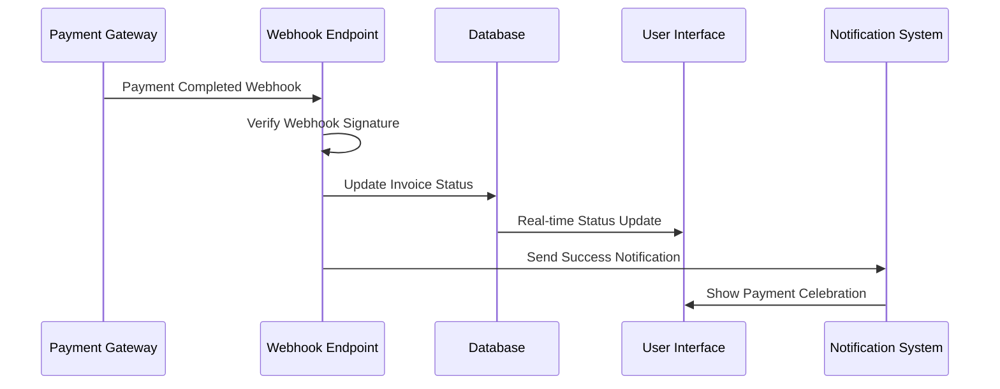

# HustleHub — External Integrations

**Integration Strategy**: UPI-first payments with WhatsApp communication  
**Current Phase**: Manual workflows with automated link generation  
**Planned**: Direct API integrations for email and payment webhooks  
**Last Updated**: 2025-01-02

## 💳 UPI Payment Integration

### UPI Protocol Implementation
**Status**: ✅ Fully Implemented  
**Purpose**: Enable instant payments through Indian UPI ecosystem

#### UPI Deeplink Generation
```javascript
// services/payments.ts
export function buildUpiIntent(params: {
  pa: string;      // Payee UPI VPA (e.g., "business@upi")
  pn: string;      // Payee Name
  am: number;      // Amount in INR
  tn?: string;     // Transaction Note
}): string {
  const queryParams = new URLSearchParams();
  queryParams.set("pa", params.pa);
  queryParams.set("pn", params.pn);
  queryParams.set("am", String(params.am));
  if (params.tn) queryParams.set("tn", params.tn);
  
  return `upi://pay?${queryParams.toString()}`;
}
```

#### QR Code Generation
```typescript
// Component usage
import QRCode from 'qrcode.react';

<QRCode 
  value={upiIntent}
  size={200}
  level="M"
  includeMargin={true}
/>
```

**User Flow**:
1. Invoice created with UPI VPA from settings
2. QR code and deeplink generated automatically
3. Client scans QR or clicks deeplink
4. UPI app opens with pre-filled payment details
5. Client completes payment in their preferred UPI app
6. Business manually marks invoice as paid

**Supported UPI Apps**: PhonePe, Google Pay, Paytm, BHIM, Bank apps

## 📱 WhatsApp Integration

### wa.me Link Integration
**Status**: ✅ Fully Implemented  
**Purpose**: Leverage WhatsApp for payment reminders and client communication

#### WhatsApp URL Builder
```javascript
// services/payments.ts
export function buildWhatsAppUrl(params: {
  phone: string;
  text: string;
}): string {
  const sanitizedPhone = sanitizePhone(params.phone);
  const encodedText = encodeURIComponent(params.text);
  return `https://wa.me/${sanitizedPhone}?text=${encodedText}`;
}

export function sanitizePhone(phone: string): string {
  const digits = phone.replace(/\D/g, "");
  // Handle Indian country code (91)
  if (digits.startsWith("91") && digits.length > 10) {
    return digits;
  }
  return digits;
}
```

#### Payment Reminder Templates
```typescript
// Payment reminder message generation
export function buildInvoiceReminderText(input: {
  clientName: string;
  invoiceNumber: string;
  amountINR: number;
  dueDateISO: string;
  status: "draft" | "sent" | "overdue" | "paid";
  upiVpa: string;
  businessName: string;
}): { message: string; upiIntent: string } {
  // Generates contextualized reminder messages
  // Includes UPI payment intent for easy payment
}
```

**Message Templates**:
- **Gentle Reminder**: "Hi [Client], friendly reminder for Invoice [#] - [Amount] due on [Date]"
- **Professional Reminder**: Formal tone with clear payment instructions
- **Firm Reminder**: Urgent tone for overdue payments with service disruption warning

**User Flow**:
1. Automated reminder scheduling (T-3, Due Date, +7 days)
2. User reviews reminder message in preview drawer
3. Click "Send via WhatsApp" opens wa.me link
4. WhatsApp opens with pre-filled message and UPI link
5. User sends message manually from WhatsApp
6. System logs message as sent for tracking

## 📧 Email Integration (Planned)

### SMTP Configuration
**Status**: ⌛ Planned for Phase 2  
**Purpose**: Direct email sending for professional communication

#### Planned Implementation
```typescript
// Planned email service structure
interface EmailConfig {
  smtpHost: string;
  smtpPort: number;
  smtpUser: string;
  smtpPassword: string;
  fromEmail: string;
  fromName: string;
}

interface EmailTemplate {
  subject: string;
  htmlContent: string;
  textContent: string;
  variables: Record<string, string>;
}

// Email service functions (planned)
async function sendInvoiceEmail(invoiceId: string, template: EmailTemplate);
async function sendPaymentReminder(invoiceId: string, reminderType: 'gentle' | 'professional' | 'firm');
async function sendPaymentConfirmation(invoiceId: string);
```

**Planned Features**:
- **SMTP Configuration**: Custom email server setup
- **Email Templates**: Professional invoice and reminder templates
- **Delivery Tracking**: Open rates and engagement metrics
- **Attachment Support**: PDF invoices attached to emails
- **Bulk Sending**: Mass reminder campaigns

**Supported Providers**:
- **SendGrid**: Transactional email service
- **Amazon SES**: AWS email service
- **Gmail SMTP**: For small businesses
- **Custom SMTP**: Any standard SMTP server

## 💰 Payment Gateway Integration (Planned)

### Razorpay Integration
**Status**: ⌛ Planned for Private Beta  
**Purpose**: Automated payment collection and status updates

#### Planned Razorpay Implementation
```typescript
// Planned Razorpay service structure
interface RazorpayConfig {
  keyId: string;
  keySecret: string;
  webhookSecret: string;
}

interface PaymentLink {
  id: string;
  shortUrl: string;
  amount: number;
  currency: 'INR';
  status: 'created' | 'partially_paid' | 'paid' | 'cancelled';
}

// Planned functions
async function createPaymentLink(invoiceId: string): Promise<PaymentLink>;
async function handlePaymentWebhook(webhookData: any): Promise<void>;
async function verifyPaymentSignature(signature: string, body: string): boolean;
```

**Planned Workflow**:
1. Invoice created with "Create Payment Link" option
2. Razorpay payment link generated automatically
3. Client receives link via WhatsApp/Email
4. Client pays using any method (UPI, cards, net banking)
5. Razorpay webhook automatically marks invoice as paid
6. Business receives real-time payment notification

**Benefits**:
- **Multiple Payment Methods**: UPI, cards, net banking, wallets
- **Automatic Status Updates**: No manual payment marking needed
- **Payment Analytics**: Detailed payment success/failure tracking
- **Refund Support**: Easy refund processing
- **International Payments**: Support for global clients

### PayU Integration (Alternative)
**Status**: ⌛ Planned as Alternative  
**Purpose**: Alternative payment gateway for specific use cases

## 🔗 API Integration Architecture

### Webhook Handling System


**Webhook Security**:
- **Signature Verification**: HMAC verification for webhook authenticity
- **Idempotency**: Prevent duplicate webhook processing
- **Error Handling**: Retry logic for failed webhook processing
- **Logging**: Complete audit trail of webhook events

### External API Rate Limiting
```typescript
// Planned rate limiting implementation
interface RateLimitConfig {
  requests: number;
  windowMs: number;
  retryAfterMs: number;
}

const rateLimits = {
  whatsapp: { requests: 100, windowMs: 60000 }, // 100/minute
  email: { requests: 1000, windowMs: 3600000 }, // 1000/hour
  razorpay: { requests: 300, windowMs: 60000 }, // 300/minute
};
```

## 📊 Integration Analytics

### Communication Tracking
**Current Implementation**: Message log system tracks all communications

```sql
-- message_log table structure
CREATE TABLE message_log (
  id uuid PRIMARY KEY,
  related_type text NOT NULL, -- 'invoice' or 'task'
  related_id uuid NOT NULL,
  channel channel_type, -- 'whatsapp' or 'email'
  template_used text,
  outcome text, -- 'sent', 'failed', 'delivered', 'read'
  sent_at timestamp DEFAULT now()
);
```

**Tracked Metrics**:
- **Message Volume**: Daily/weekly communication statistics
- **Channel Effectiveness**: WhatsApp vs Email success rates
- **Template Performance**: Which reminder tones work best
- **Response Rates**: Client engagement with different message types

### Payment Success Analytics
**Planned Implementation**: Comprehensive payment tracking

```typescript
// Planned payment analytics
interface PaymentMetrics {
  paymentMethod: 'upi' | 'card' | 'netbanking' | 'wallet';
  timeToPay: number; // Minutes from invoice to payment
  reminderCount: number; // Reminders sent before payment
  successRate: number; // Payment success percentage
  averageAmount: number; // Average payment amount
}
```

## 🔒 Integration Security

### Data Privacy & Protection
**Current Measures**:
- **Data Minimization**: Sensitive client data excluded from external calls
- **Secure Transmission**: HTTPS for all external communications
- **No Data Storage**: External services don't store client data
- **Audit Logging**: Complete record of all external interactions

**Planned Security Enhancements**:
- **API Key Rotation**: Regular rotation of integration credentials
- **Encryption at Rest**: Sensitive integration data encrypted
- **Access Controls**: Role-based access to integration settings
- **Compliance**: GDPR/PCI compliance for payment processing

### Error Handling & Resilience
```typescript
// Robust error handling pattern
async function sendWhatsAppReminder(reminder: Reminder) {
  try {
    const message = buildReminderMessage(reminder);
    const whatsappUrl = buildWhatsAppUrl(message);
    
    // Log attempt
    await logMessageAttempt(reminder.id, 'whatsapp', message);
    
    // Open WhatsApp (user action required)
    window.open(whatsappUrl, '_blank');
    
    // Log success (user confirmation required)
    await logMessageSent(reminder.id, 'whatsapp', 'sent');
    
  } catch (error) {
    // Log failure
    await logMessageSent(reminder.id, 'whatsapp', 'failed');
    
    // Show user-friendly error
    showErrorToast('Failed to open WhatsApp. Please try again.');
    
    // Offer alternative
    showFallbackOptions(reminder);
  }
}
```

## 🚀 Future Integration Roadmap

### Q2 2025: Email & Payment Automation
- **Email SMTP Integration**: Direct email sending capability
- **Razorpay Payment Links**: Automated payment collection
- **Webhook Processing**: Real-time payment status updates

### Q3 2025: Advanced Integrations
- **Accounting Software APIs**: QuickBooks, Tally integration
- **Calendar Integration**: Google Calendar, Outlook synchronization
- **CRM Integration**: Salesforce, HubSpot client sync

### Q4 2025: AI & Analytics
- **AI-Powered Reminders**: Smart reminder timing optimization
- **Predictive Analytics**: Payment prediction models
- **Natural Language Processing**: Automatic message personalization

## 📈 Integration Success Metrics

### Key Performance Indicators
- **Payment Collection Speed**: Average days from invoice to payment
- **Communication Effectiveness**: Response rates by channel and template
- **User Adoption**: Percentage of users using automated features
- **Error Rates**: Failed integration attempts and resolution time
- **Cost Efficiency**: Integration costs vs manual process savings

### Monitoring & Alerting
- **Real-time Monitoring**: Integration health and performance dashboards
- **Error Alerting**: Immediate notification of integration failures
- **Usage Analytics**: Track integration usage patterns and optimization opportunities
- **Performance Metrics**: Response times and success rates for all integrations