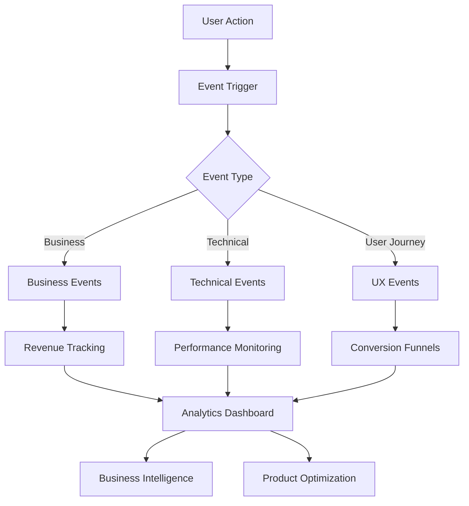

# HustleHub — Telemetry & Analytics

**Purpose**: Track user behavior, business metrics, and system performance  
**Privacy-First**: No PII collection, anonymized usage analytics  
**Current State**: Basic celebration system, ready for comprehensive analytics  
**Last Updated**: 2025-01-02

## 📊 Analytics Framework

### Event Tracking Architecture


### Current Implementation Status
- **Celebration System**: ✅ Implemented (`CelebrationProvider.tsx`)
- **Form Validation**: ✅ Built-in error tracking
- **Database Views**: ✅ Dashboard metrics (`v_dashboard_metrics`)
- **Message Logging**: ✅ Communication history tracking
- **Advanced Analytics**: ⌛ Planned for Phase 2

## 🎯 Business Events

### Revenue & Payment Tracking

#### Invoice Lifecycle Events
```typescript
// Event: invoice_created
interface InvoiceCreatedEvent {
  event: 'invoice_created';
  timestamp: number;
  properties: {
    invoice_id: string;
    client_id: string;
    amount: number;
    currency: 'INR';
    gst_amount: number;
    has_project: boolean;
    items_count: number;
    creation_method: 'manual' | 'template' | 'task_conversion';
  };
}

// Event: invoice_sent
interface InvoiceSentEvent {
  event: 'invoice_sent';
  timestamp: number;
  properties: {
    invoice_id: string;
    send_method: 'whatsapp' | 'email' | 'manual_share';
    recipient_type: 'client' | 'other';
  };
}

// Event: payment_received
interface PaymentReceivedEvent {
  event: 'payment_received';
  timestamp: number;
  properties: {
    invoice_id: string;
    amount: number;
    payment_method: 'upi' | 'bank_transfer' | 'cash' | 'other';
    days_to_payment: number;
    reminder_count: number;
    utr_provided: boolean;
  };
}
```

**Success Criteria**:\
- **Invoice Creation Rate**: > 80% of new users create first invoice within 24h
- **Payment Collection Speed**: Average < 15 days from invoice to payment
- **Payment Success Rate**: > 85% of sent invoices eventually paid

#### Client Relationship Events
```typescript
// Event: client_created
interface ClientCreatedEvent {
  event: 'client_created';
  timestamp: number;
  properties: {
    client_id: string;
    has_whatsapp: boolean;
    has_email: boolean;
    has_gstin: boolean;
    has_upi_vpa: boolean;
    creation_source: 'manual' | 'onboarding' | 'invoice_flow';
  };
}

// Event: client_communication
interface ClientCommunicationEvent {
  event: 'client_communication';
  timestamp: number;
  properties: {
    client_id: string;
    communication_type: 'invoice_sent' | 'reminder_sent' | 'follow_up';
    channel: 'whatsapp' | 'email' | 'phone';
    template_used: string;
    response_received: boolean;
  };
}
```

## 🚀 User Journey Events

### Onboarding & Activation
```typescript
// Event: signup_started
interface SignupStartedEvent {
  event: 'signup_started';
  timestamp: number;
  properties: {
    signup_method: 'email' | 'google' | 'apple';
    referral_source?: string;
    utm_campaign?: string;
  };
}

// Event: signup_completed
interface SignupCompletedEvent {
  event: 'signup_completed';
  timestamp: number;
  properties: {
    user_id: string;
    signup_method: 'email' | 'google' | 'apple';
    email_verified: boolean;
    time_to_complete: number; // seconds
  };
}

// Event: onboarding_step_completed
interface OnboardingStepEvent {
  event: 'onboarding_step_completed';
  timestamp: number;
  properties: {
    step_number: 1 | 2 | 3 | 4;
    step_name: 'business_info' | 'upi_setup' | 'first_client' | 'payment_method';
    completion_time: number; // seconds on step
    skipped: boolean;
  };
}

// Event: onboarding_completed
interface OnboardingCompletedEvent {
  event: 'onboarding_completed';
  timestamp: number;
  properties: {
    total_time: number; // minutes
    steps_skipped: number;
    demo_data_populated: boolean;
  };
}
```

**Conversion Funnels**:\
1. **Signup → Email Verification**: Target 90%
2. **Email Verification → Onboarding Start**: Target 85%
3. **Onboarding Start → First Invoice**: Target 75%
4. **First Invoice → First Payment**: Target 60%

### Feature Adoption Events
```typescript
// Event: feature_first_use
interface FeatureFirstUseEvent {
  event: 'feature_first_use';
  timestamp: number;
  properties: {
    feature_name: 'tasks' | 'reminders' | 'savings_goals' | 'qr_codes' | 'pdf_generation';
    days_since_signup: number;
    triggered_by: 'navigation' | 'onboarding' | 'quick_action';
  };
}

// Event: workflow_completed
interface WorkflowCompletedEvent {
  event: 'workflow_completed';
  timestamp: number;
  properties: {
    workflow_type: 'invoice_to_payment' | 'client_onboarding' | 'reminder_sequence';
    steps_completed: number;
    total_time: number; // minutes
    success: boolean;
  };
}
```

## ⚡ Technical Events

### Performance Monitoring
```typescript
// Event: page_load_performance
interface PageLoadEvent {
  event: 'page_load_performance';
  timestamp: number;
  properties: {
    page_name: string;
    load_time: number; // milliseconds
    time_to_interactive: number;
    largest_contentful_paint: number;
    cumulative_layout_shift: number;
    first_input_delay: number;
    connection_type: '4g' | '3g' | '2g' | 'wifi' | 'unknown';
  };
}

// Event: api_performance
interface ApiPerformanceEvent {
  event: 'api_performance';
  timestamp: number;
  properties: {
    endpoint: string;
    method: 'GET' | 'POST' | 'PUT' | 'DELETE';
    response_time: number; // milliseconds
    status_code: number;
    error_type?: string;
    retry_count: number;
  };
}
```

**Performance Targets**:\
- **Page Load**: < 2 seconds on 3G networks
- **API Response**: < 500ms for CRUD operations
- **Time to Interactive**: < 3 seconds for dashboard

### Error Tracking
```typescript
// Event: error_occurred
interface ErrorEvent {
  event: 'error_occurred';
  timestamp: number;
  properties: {
    error_type: 'javascript' | 'network' | 'validation' | 'auth';
    error_message: string;
    stack_trace?: string;
    page_url: string;
    user_action: string;
    recoverable: boolean;
    recovery_action?: string;
  };
}

// Event: error_recovered
interface ErrorRecoveryEvent {
  event: 'error_recovered';
  timestamp: number;
  properties: {
    original_error_id: string;
    recovery_method: 'retry' | 'fallback' | 'user_action';
    time_to_recovery: number; // seconds
    successful: boolean;
  };
}
```

## 🎉 Engagement Events

### Celebration System Analytics
**Current Implementation**: Basic celebration tracking exists
```typescript
// Event: celebration_triggered
interface CelebrationEvent {
  event: 'celebration_triggered';
  timestamp: number;
  properties: {
    celebration_type: 'invoice_created' | 'payment_received' | 'goal_achieved' | 'milestone_reached';
    trigger_value?: number; // amount, count, etc.
    user_engagement: 'viewed' | 'dismissed' | 'shared';
    celebration_duration: number; // seconds
  };
}

// Event: milestone_achieved
interface MilestoneEvent {
  event: 'milestone_achieved';
  timestamp: number;
  properties: {
    milestone_type: 'first_invoice' | 'first_payment' | '10_invoices' | '100k_revenue';
    days_since_signup: number;
    total_value?: number;
    celebration_shown: boolean;
  };
}
```

### User Engagement Patterns
```typescript
// Event: session_started
interface SessionStartEvent {
  event: 'session_started';
  timestamp: number;
  properties: {
    device_type: 'mobile' | 'tablet' | 'desktop';
    browser: string;
    returning_user: boolean;
    time_since_last_session?: number; // hours
  };
}

// Event: feature_interaction
interface FeatureInteractionEvent {
  event: 'feature_interaction';
  timestamp: number;
  properties: {
    feature_name: string;
    action_type: 'click' | 'hover' | 'scroll' | 'form_submit';
    element_id: string;
    page_context: string;
    interaction_depth: number; // clicks in sequence
  };
}
```

## 🔍 Analytics Implementation

### Data Collection Strategy
```typescript
// Analytics service interface
interface AnalyticsService {
  track(event: string, properties: Record<string, any>): void;
  identify(userId: string, traits: Record<string, any>): void;
  page(name: string, properties?: Record<string, any>): void;
  group(groupId: string, traits: Record<string, any>): void;
}

// Current celebration system integration
// src/hooks/useCelebrate.ts
export function useCelebrate() {
  const triggerCelebration = useCallback((type: CelebrationType, data?: any) => {
    // Analytics tracking integration point
    analytics.track('celebration_triggered', {
      celebration_type: type,
      trigger_value: data?.amount || data?.count,
      timestamp: Date.now()
    });
    
    // Existing celebration logic
    setCelebration({ type, visible: true, data });
  }, []);
}
```

### Privacy-First Analytics
**Data Minimization Principles**:\
- **No PII Collection**: Email, phone, names never tracked
- **Anonymized IDs**: UUID-based user identification
- **Aggregate Data**: Individual actions rolled up to patterns
- **Local Storage**: Sensitive analytics stored client-side only
- **Opt-out Support**: User preference for analytics collection
```typescript
// Privacy-safe event properties
interface PrivacySafeEvent {
  event: string;
  timestamp: number;
  anonymous_user_id: string; // UUID, not email
  session_id: string;
  properties: {
    // ✅ Allowed: Business metrics, feature usage, performance
    amount_range: '0-1k' | '1k-10k' | '10k+'; // Not exact amounts
    client_count_bucket: '1-5' | '6-20' | '21+';
    feature_adoption_stage: 'new' | 'active' | 'power_user';
    
    // ❌ Forbidden: Client names, emails, addresses, exact amounts
  };
}
```

## 📈 Analytics Dashboard

### Business Intelligence Views
```sql
-- Planned analytics views
CREATE VIEW user_journey_funnel AS
SELECT 
  signup_date,
  COUNT(*) as signups,
  COUNT(CASE WHEN onboarding_completed THEN 1 END) as completed_onboarding,
  COUNT(CASE WHEN first_invoice_date IS NOT NULL THEN 1 END) as created_invoice,
  COUNT(CASE WHEN first_payment_date IS NOT NULL THEN 1 END) as received_payment
FROM user_analytics
GROUP BY signup_date
ORDER BY signup_date DESC;

-- Revenue analytics
CREATE VIEW revenue_metrics AS
SELECT 
  DATE_TRUNC('month', created_at) as month,
  COUNT(*) as invoices_created,
  COUNT(CASE WHEN status = 'paid' THEN 1 END) as invoices_paid,
  SUM(total_amount) as total_invoiced,
  SUM(CASE WHEN status = 'paid' THEN total_amount END) as total_collected,
  AVG(CASE WHEN status = 'paid' THEN 
    EXTRACT(days FROM paid_date - created_at) 
  END) as avg_days_to_payment
FROM invoices
GROUP BY DATE_TRUNC('month', created_at);
```

### Real-time Monitoring
**Planned Implementation**:\
- **Live User Sessions**: Real-time user activity monitoring
- **Feature Usage Heat Maps**: Visual representation of feature adoption
- **Conversion Funnel Tracking**: Live funnel performance metrics
- **Error Rate Monitoring**: Real-time error tracking and alerting

## 🚨 Alerting & Monitoring

### Business Metric Alerts
```typescript
// Alert conditions
interface BusinessAlert {
  metric: string;
  condition: 'above' | 'below' | 'change';
  threshold: number;
  timeframe: 'hour' | 'day' | 'week';
  action: 'email' | 'slack' | 'dashboard';
}

const businessAlerts: BusinessAlert[] = [
  {
    metric: 'signup_conversion_rate',
    condition: 'below',
    threshold: 0.7, // 70%
    timeframe: 'day',
    action: 'email'
  },
  {
    metric: 'payment_collection_time',
    condition: 'above', 
    threshold: 20, // days
    timeframe: 'week',
    action: 'dashboard'
  },
  {
    metric: 'error_rate',
    condition: 'above',
    threshold: 0.05, // 5%
    timeframe: 'hour',
    action: 'slack'
  }
];
```

### System Health Monitoring
- **Uptime Monitoring**: 99.9% availability target
- **Performance Degradation**: Response time increase alerts
- **Database Performance**: Query performance and connection pool monitoring
- **Third-party Integration Health**: UPI, WhatsApp, email service status

## 🎯 Success Metrics & KPIs

### Product Success Metrics
| Metric | Target | Current Status |
|--------|--------|----------------|
| **User Activation Rate** | 80% create first invoice within 24h | 🔄 To implement |
| **Payment Collection Speed** | < 15 days average | 🔄 To track |
| **Feature Adoption Rate** | 60% use reminders within 30 days | 🔄 To measure |
| **User Retention Rate** | 70% monthly active users | 🔄 To monitor |
| **Error Rate** | < 2% of all user actions | ✅ Currently tracking |

### Business Impact Metrics
- **Revenue Acceleration**: Payment collection improvement vs manual methods
- **User Satisfaction**: NPS score and support ticket reduction
- **Market Penetration**: User growth in target segments
- **Cost Efficiency**: Operational cost reduction per user

## 🔮 Future Analytics Enhancements

### Phase 2: Advanced Analytics (Q2 2025)
- **Predictive Analytics**: Payment likelihood prediction models
- **User Segmentation**: Behavior-based user clustering
- **A/B Testing Framework**: Feature and UX optimization testing
- **Custom Dashboards**: User-configurable analytics views

### Phase 3: AI-Powered Insights (Q3 2025)
- **Smart Recommendations**: AI-driven business optimization suggestions
- **Anomaly Detection**: Automatic detection of unusual patterns
- **Natural Language Queries**: \"How many invoices were paid last month?\"
- **Automated Reporting**: AI-generated business insights and summaries
